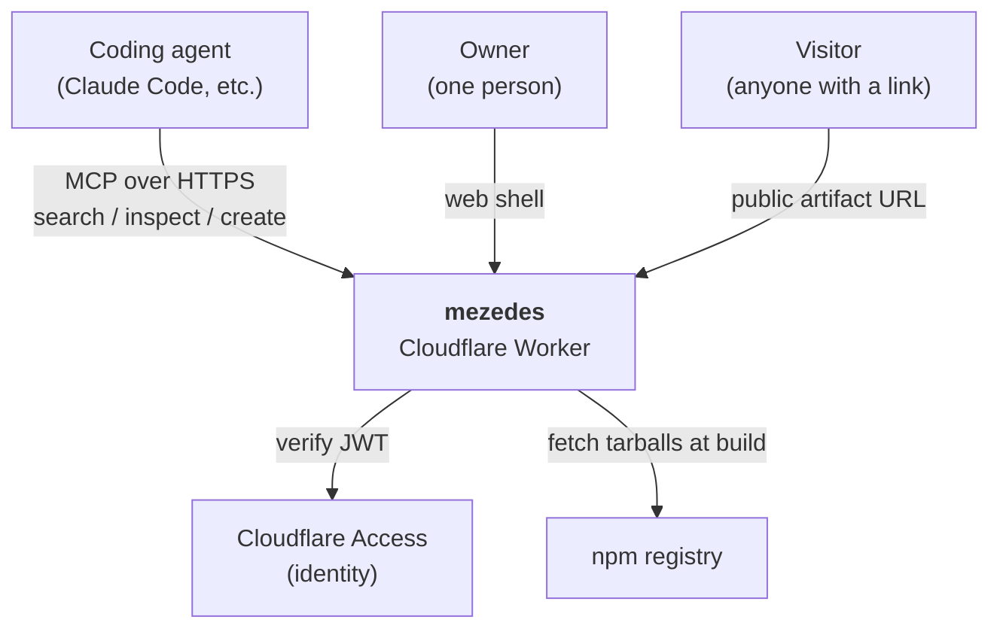
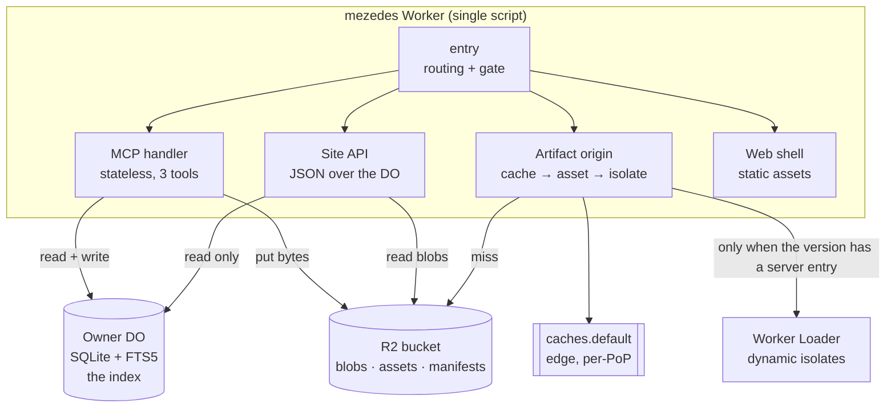
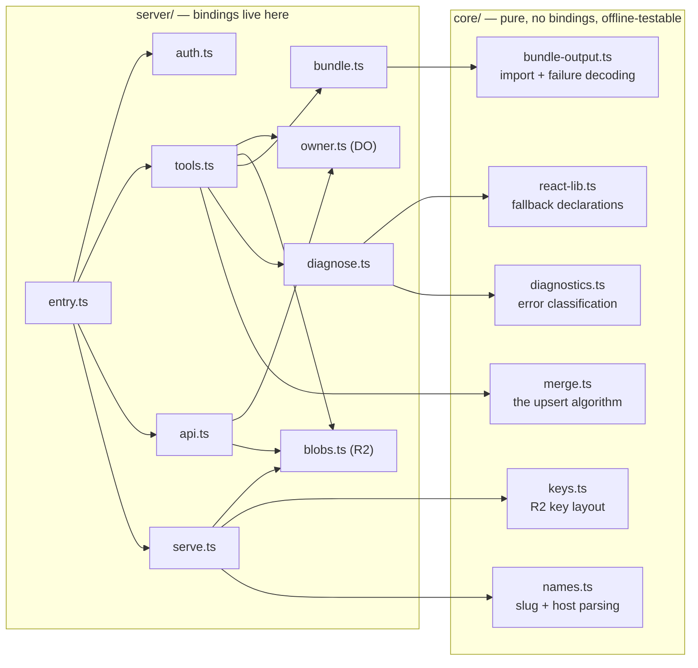
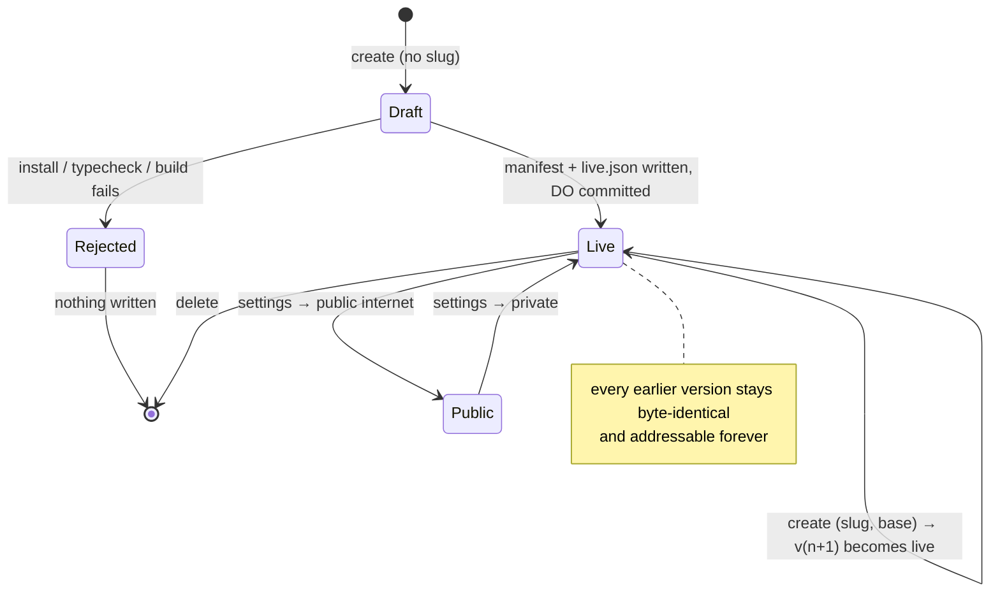
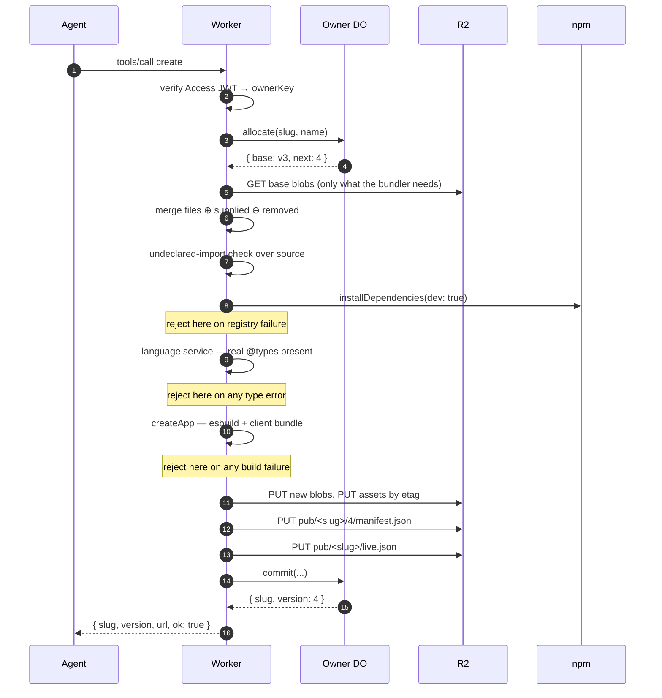
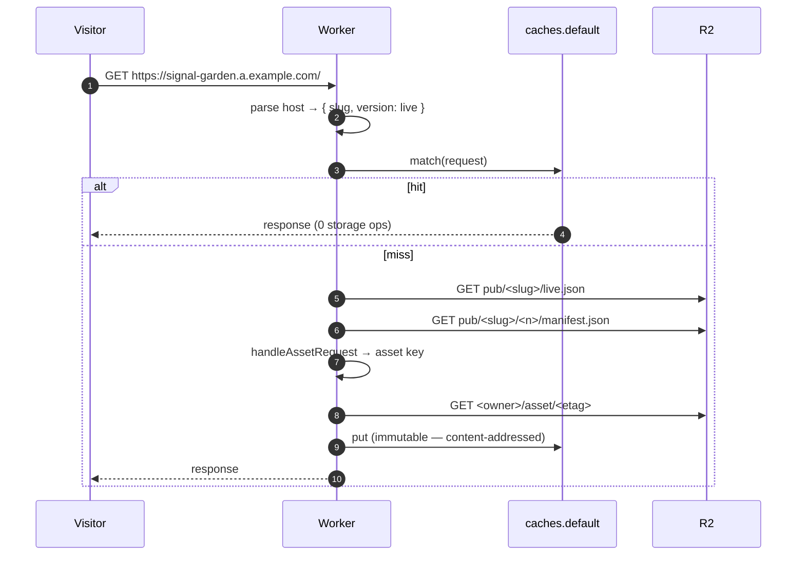
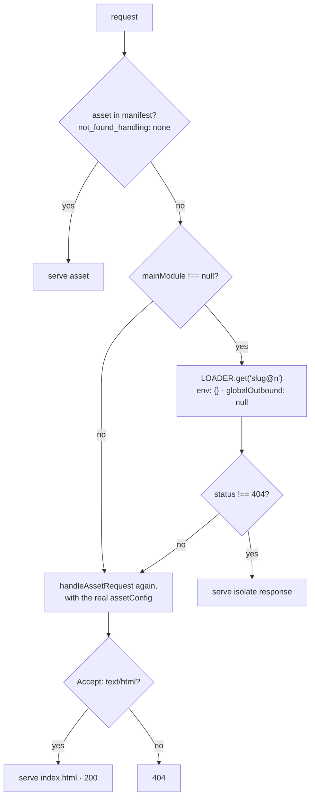
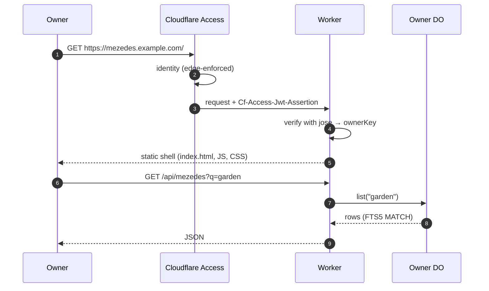
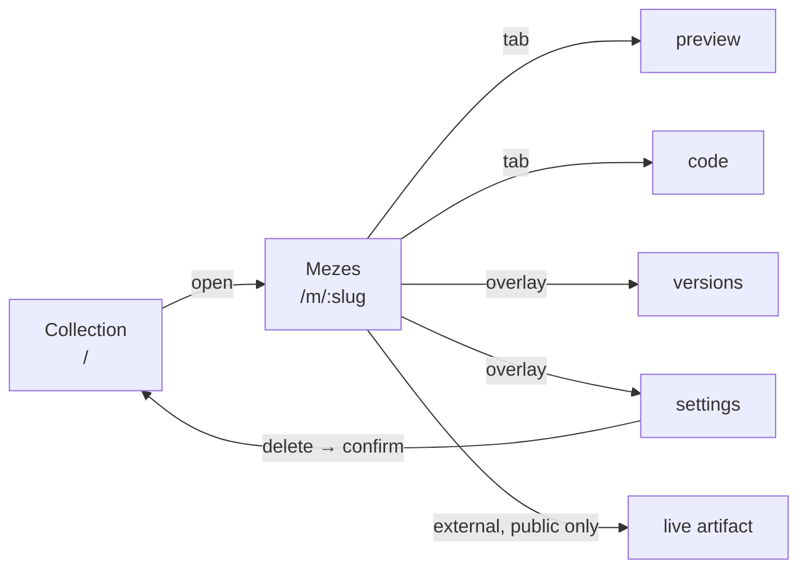

# mezedes — implementation specification

One Cloudflare Worker. An MCP surface with three tools, a private web shell for
the owner, and a public origin that serves what the tools built.

This document is complete. Every decision is made, every version is pinned, and
the modules that are already-solved problems are given in full source below.
Implement it as written.

---

## 1. What it is

An agent calls `create` over MCP with a set of files. The Worker installs the
dependencies, typechecks, bundles, publishes, and returns a URL that already
serves. The owner browses what exists in a web shell; anyone with a link can
open a mezes that has been made public.

**Terms.**

| Term        | Meaning                                                                    |
| ----------- | -------------------------------------------------------------------------- |
| **mezes**   | A named thing, addressed by `slug`. Has many versions.                     |
| **version** | An immutable, monotonically numbered snapshot of a file set. `v1`, `v2`, … |
| **live**    | The version a bare mezes URL serves. Always the newest published version.  |
| **blob**    | One file's bytes, content-addressed by sha-256.                            |
| **asset**   | One built output's bytes, content-addressed by etag.                       |

**Not in scope.** No sessions. No workspace, VFS, or git. No agent file-editing
tools — the model sends whole files. No screenshots or headless browsers. No
collaborative editing. No multi-user anything.

---

## 2. Architecture

### C4 — Context



### C4 — Container



**The one rule that shapes everything:** the artifact read path never touches
the Durable Object. A DO lives in a single location; artifacts are opened by
whoever the link was shared with. Serving is a pure function of the hostname
into an R2 key, cacheable at the edge PoP that received the request.

### C4 — Component



**Enforced boundaries.** Nothing in `core/` imports from `server/`. Nothing but
`blobs.ts` names `R2Bucket`. Nothing but `owner.ts` names the DO namespace. All
three are a single grep and should be a test.

---

## 3. Repository layout

Single package. Not a monorepo.

```
.
├── package.json
├── tsconfig.json
├── .fallowrc.json              # architecture boundaries, enforced (section 18)
├── .mcp.json                   # points an agent at the local dev server
├── alchemy.run.ts              # infrastructure
├── vite.config.ts              # shell build + lint/format/staged-hook config
├── index.html                  # web shell entry
├── plugin/                     # the Claude Code plugin (§17)
│   ├── .claude-plugin/plugin.json
│   ├── .mcp.json
│   ├── commands/mezes.md
│   └── skills/mezedes/SKILL.md
├── src/
│   ├── core/                   # pure — no bindings, no cloudflare: imports
│   │   ├── names.ts
│   │   ├── keys.ts
│   │   ├── merge.ts
│   │   ├── diagnostics.ts
│   │   ├── bundle-output.ts
│   │   ├── react-lib.ts
│   │   └── seed.ts
│   ├── server/
│   │   ├── entry.ts            # the Worker `main`
│   │   ├── auth.ts
│   │   ├── owner.ts            # the Durable Object
│   │   ├── blobs.ts
│   │   ├── bundle.ts
│   │   ├── diagnose.ts
│   │   ├── serve.ts
│   │   ├── tools.ts            # the 3 MCP tools
│   │   └── api.ts              # the shell's JSON API
│   └── shell/                  # the web shell (React, built by vite)
│   │   ├── tsconfig.json       # DOM instead of the Workers runtime
│       ├── main.tsx
│       ├── App.tsx
│       ├── theme.css
│       └── components/…
├── test/                       # offline (bun test)
└── integ/                      # live (bun test, alchemy dev)
```

`dist/shell/` is vite's output and is uploaded as the Worker's static assets.

---

## 4. Dependencies — exact versions

```json
{
  "name": "mezedes",
  "private": true,
  "type": "module",
  "scripts": {
    "build": "vite build",
    "test": "bun test ./test/",
    "test:integ": "bun test ./integ/",
    "deploy": "bun run build && alchemy deploy ./alchemy.run.ts --stage $ALCHEMY_STAGE --yes",
    "destroy": "alchemy destroy ./alchemy.run.ts --stage $ALCHEMY_STAGE --yes"
  },
  "dependencies": {
    "@cloudflare/worker-bundler": "0.2.2",
    "@modelcontextprotocol/server": "2.0.0",
    "agents": "0.20.1",
    "jose": "6.2.6",
    "zod": "4.4.3"
  },
  "devDependencies": {
    "@cloudflare/workers-types": "5.20260801.1",
    "@types/bun": "1.3.14",
    "@types/react": "19.2.18",
    "@types/react-dom": "19.2.4",
    "@vitejs/plugin-react": "5.0.4",
    "alchemy": "2.0.0-beta.65",
    "effect": "4.0.0-beta.101",
    "react": "19.2.8",
    "react-dom": "19.2.8",
    "typescript": "7.0.2"
  },
  "engines": { "node": ">=22.18.0" },
  "devEngines": {
    "packageManager": { "name": "bun", "version": "1.3.14", "onFail": "download" }
  }
}
```

Runtime: `compatibility_date = "2026-07-01"`, `compatibility_flags = ["nodejs_compat"]`.

The build, format and lint toolchain — and the git hooks that run it — are
already configured in the repository. `package.json` and `vite.config.ts` are
provided; do not author or overwrite them. This list is the _runtime and test_
contract only.

**Two tsconfigs, deliberately.** A Worker and a browser bundle do not share
globals. Given one `lib`, `lib.dom`'s `CacheStorage` wins over the Workers one —
they do not merge — and `caches.default` becomes unreachable, which invites a
hand-written ambient declaration to paper over it. The root config carries
`lib: ["ES2023"]` and `types: ["@cloudflare/workers-types", "bun"]` for the
Worker, its tests and the stack; `src/shell/tsconfig.json` extends it with DOM
and no Workers types. Editors resolve the nearest automatically, and
`bun run typecheck` runs both.

**Why these are pinned.** `@cloudflare/worker-bundler` is pre-1.0 and its API
moves; `agents` is pinned because `createMcpHandler` is the stateless handler
(it re-exports `createStatelessMcpHandler`) and that is load-bearing —
`McpAgent` requires a Durable Object and is not used. `alchemy` and `effect`
are betas.

---

## 5. Data model

### 5.1 Owner Durable Object — the index

One DO per owner. `env.OWNER.getByName(ownerKey)` where `ownerKey` is the
sha-256 of the verified identity claim (`email`), first 16 hex chars, derived
per request in `entry.ts` from the token the gate just checked.

The Access policy is the only thing that decides who may be here. Nothing
re-declares it: widening the policy to a second person gives that person their
own index and their own blob prefix, rather than a share of the first's.

The DO is the **only writer** and the **only place metadata lives**.

```sql
CREATE TABLE IF NOT EXISTS mezes (
  slug        TEXT PRIMARY KEY,
  name        TEXT NOT NULL,
  description TEXT NOT NULL DEFAULT '',
  head        INTEGER NOT NULL,
  visibility  TEXT NOT NULL DEFAULT 'private',   -- 'private' | 'public'
  created_at  INTEGER NOT NULL,
  updated_at  INTEGER NOT NULL
);

CREATE TABLE IF NOT EXISTS version (
  slug    TEXT NOT NULL,
  n       INTEGER NOT NULL,
  at      INTEGER NOT NULL,
  note    TEXT NOT NULL DEFAULT '',
  files   TEXT NOT NULL,        -- JSON: { [path]: sha256 }
  build   TEXT NOT NULL,        -- JSON: BuildRecord
  PRIMARY KEY (slug, n)
);

CREATE VIRTUAL TABLE IF NOT EXISTS mezes_fts
  USING fts5(slug UNINDEXED, name, description, tokenize = 'porter unicode61');
```

`mezes` and `mezes_fts` are written in the same transaction. The DO's
single-threaded write path is what guarantees they cannot drift; do not add
triggers.

```ts
interface BuildRecord {
  /** null when the version has no server entry — no isolate is ever loaded. */
  readonly mainModule: string | null;
  readonly modules: Record<string, string>;
  readonly assets: readonly [path: string, meta: { contentType?: string; etag: string }][];
  readonly assetConfig: { not_found_handling: "single-page-application" };
}
```

**DO RPC surface.** Every method is called only from the Worker, never from a
browser.

```ts
list(query?: string, limit?: number): Promise<MezesSummary[]>
get(slug: string): Promise<MezesDetail | null>
versionOf(slug: string, n?: number): Promise<VersionRecord | null>
allocate(slug: string, name: string): Promise<{ base: VersionRecord | null; next: number }>
commit(input: CommitInput): Promise<{ slug: string; version: number }>
update(slug: string, patch: { name?: string; visibility?: Visibility }): Promise<MezesDetail>
remove(slug: string): Promise<{ removed: boolean }>
```

`allocate` + `commit` run inside one DO invocation per `create` call, so version
numbers are genuinely monotonic and two concurrent creates get 4 and 5 rather
than both getting 4. There is no compare-and-set anywhere; the DO's
single-threaded execution **is** the lock.

### 5.2 R2 — bytes only

```
<owner>/blob/<sha256>                          source file bytes, immutable
<owner>/asset/<etag>                           built output bytes, immutable
pub/<slug>/<n>/manifest.json                   everything serving a version needs
pub/<slug>/live.json                           { "version": <n>, "visibility": "…" }
```

Blobs and assets are scoped by owner so a file shared between two mezedes is
stored once. The `pub/` prefix is deliberately **not** owner-scoped: it is what
the artifact origin resolves from the hostname alone, with no identity in play.

`serve.ts` reads all three through `blobs.ts` (`readLive`, `readManifest`,
`readAssetBytes`), which takes a `BucketEnv` — just the bucket, no owner. That is
what keeps `R2Bucket` named in two places only: `blobs.ts`, the adapter, and
`env.ts`, the binding contract.

`manifest.json` is the `BuildRecord` plus `{ slug, version, visibility, owner }`.
The `owner` field is what lets the artifact origin find the asset bytes without
knowing who is asking — serving is unauthenticated and has no token to derive an
identity from, so the identity has to travel with the published manifest. It is
written **last**, after every blob and asset it references. A crash mid-create
leaves orphaned bytes that nothing points at, never a manifest that points at
bytes which are not there.

### 5.3 Entity lifecycle



---

## 6. Versioning and upsert

A version is a monotonic integer. Its file set is a right-biased merge of its
base with whatever was supplied.

```
files(v_{n+1}) = files(v_n) ⊕ supplied ⊖ removed
```

**Worked example.** v3 holds `App.tsx`, `Chart.tsx`, `app.css`. The model
supplies a new `Chart.tsx`, a new `useData.ts`, and `remove: ["app.css"]`.

| Path         | in v3      | supplied | in v4      | bytes written                  |
| ------------ | ---------- | -------- | ---------- | ------------------------------ |
| `App.tsx`    | `sha:a1c…` | —        | `sha:a1c…` | none — the reference is copied |
| `Chart.tsx`  | `sha:b0f…` | new      | `sha:9e4…` | one blob PUT                   |
| `app.css`    | `sha:77d…` | removed  | absent     | none — v3 still references it  |
| `useData.ts` | absent     | new      | `sha:2ab…` | one blob PUT                   |

v3 stays byte-identical and serveable forever, because nothing at a
content-addressed key can be overwritten.

**Deletion needs its own field.** A subset merge cannot express removal —
supplying nothing for a path is indistinguishable from leaving it alone. Hence
`remove: string[]`. Without it a mezes can only ever grow.

`src/core/merge.ts`:

```ts
export interface MergeInput {
  readonly base: Readonly<Record<string, string>>;
  readonly supplied: Readonly<Record<string, string>>;
  readonly removed: readonly string[];
}

/** Right-biased over `base`, then `removed` applied. Pure; the correctness core. */
export const mergeFiles = (input: MergeInput): Record<string, string> => {
  const merged: Record<string, string> = { ...input.base, ...input.supplied };
  for (const path of input.removed) delete merged[path];
  return merged;
};
```

---

## 7. The submit contract

Every `create` is gated, and the gate is the only quality guarantee the product
has. Without a session there is no iterating toward correctness, so the tool
call itself has to be the gate.

```
install dependencies → typecheck → bundle → publish
```

**Any failure at any stage rejects the whole submission.** No blob is kept, no
version number is allocated, and the previous live version keeps serving
untouched. The invariant is simple enough to state in the tool description: _a
version that exists is a version that typechecked and built._

Order matters. Dependencies are installed **before** the language service runs,
so the check is against the real `@types/react` rather than a stub. That is what
makes `<input maxLength="ten" />`, a wrong `useEffect` dependency array, or a
`setState` of the wrong type an error at all.

---

## 8. Request lifecycles

### 8.1 `create`, end to end



Bytes land before the index that points at them. The DO commit is last.

### 8.2 Serving a static artifact — the common case



No Durable Object is involved. Assets are content-addressed, so a cache entry
can never be stale and is stored `immutable`.

### 8.3 Serving an artifact that has a server entry



**The ordering is load-bearing.** `handleAssetRequest` is called twice. The
first call withholds `not_found_handling` so the single-page fallback cannot
answer a route the authored server owns before the isolate has seen it. The
second call uses the manifest's real config and lets the bundler's own fallback
run — it is gated on the request's `Accept` header, so a client router survives
a refresh while a `fetch()` that misses still gets an honest 404.

**Cost.** A version with `mainModule: null` never loads an isolate, so it is
free. Dynamic Workers bill per unique _(worker id, code)_ pair per day, which is
why the loader id is version-pinned: re-serving an old version reuses its
isolate, and only a genuinely new version creates a billable one.

### 8.4 The shell



---

## 9. Routing and origins

| Host / path                  | What                                      | Gate   |
| ---------------------------- | ----------------------------------------- | ------ |
| `mezedes.<zone>/`            | the shell                                 | Access |
| `mezedes.<zone>/api/*`       | shell JSON API                            | Access |
| `mezedes.<zone>/mcp`         | MCP surface                               | Access |
| `p--<token>.<artifactZone>`  | a preview, at ANY visibility              | token  |
| `<slug>.<artifactZone>`      | live artifact, **public mezedes only**    | none   |
| `<slug>-v<n>.<artifactZone>` | a pinned version, **public mezedes only** | none   |

Artifacts live on their **own zone**, not a label under the shell's. Two reasons,
both load-bearing:

1. **Certificate.** `<slug>.<artifactZone>` is one label under its zone, which is
   what Universal SSL issues for. The earlier `<slug>.a.<zone>` was two, where
   Cloudflare accepts the wildcard custom domain and then cannot validate a
   certificate — so the deploy reports success and every shared link fails the
   TLS handshake.
2. **Gate.** Access applications are per hostname, and the artifact zone has none.
   Separating the zones makes "no Access on artifacts" a property of the deploy
   rather than a rule someone has to remember.

`entry.ts` matches the artifact hosts **before** the auth gate. Access enforces
at the edge, so this is also a deployment fact: the Access application covers
`mezedes.<zone>` only. The artifact zone has no Access application at all.

**Privacy without session state.** A private mezes is never reachable at
`<slug>.<artifactZone>` — that origin returns 404 when the manifest says
`private`, and only a preview token reaches it. The
owner still previews it, at the preview origin below, whose token `/api` mints
and Access therefore controls. Toggling to public does not move any URL; it makes the public host start
resolving.

**A preview is an ORIGIN, not a path.** There is no `/preview/` route, and the
reason is a browser rule rather than taste. A frame on the shell's own hostname
runs on an opaque origin, which makes its `<script type="module">` fetch
cross-origin; the browser therefore sends no credentials; and Access answers
that credential-less request for the mezes's own `./client.js` with a 401 at the
edge, before `entry.ts` runs. No response the Worker could write ever reaches
the browser — which is why `Access-Control-Allow-Origin` cannot fix it, and why
moving the preview off the gated hostname is the only fix.

So the shell frames `p--<token>.<artifactZone>`, minted by
`GET /api/mezedes/<slug>/v/<n>/preview` and therefore owner-only, since `/api`
is behind Access. **The token in the hostname IS the authorisation**: it is 128
unguessable bits, it is the only thing that resolves those bytes, and it is
checked before any visibility test — a preview serves a private mezes, which is
the whole point. Being an origin rather than a prefix also means every path the
mezes was built with resolves, absolute as well as relative.

Minting is idempotent per version: `pub/<slug>/<n>/grant.json` holds the token
already granted, so viewing twice does not hand out a second capability. There
is no expiry — the URL is the grant, and an expiring preview would break a frame
mid-session. Revocation is deleting the mezes, which clears `grant/<token>.json`
by name, because grants live outside `pub/<slug>/` and the prefix delete would
otherwise leave every preview URL still resolving.

**The preview frame is sandboxed.** `<iframe sandbox="allow-scripts">` and
deliberately **without** `allow-same-origin`, so the frame gets an opaque origin
and model-generated JavaScript cannot reach `/api` with the owner's Access
cookie attached. The design's `sandbox` label on the frame is this property made
visible. This is the single most important line in the shell; do not add
`allow-same-origin` to make something work.

The opaque origin has one consequence worth stating outright, because it looks
like a bug in the mezes rather than in the arrangement: a module script fetched
by an opaque origin is cross-origin, so the browser sends no credentials with
it. Any gate that answers on the frame's own hostname therefore rejects the
mezes's own `./client.js`. That is why a public preview frames the artifact zone,
which has no such gate — see §9.

**DNS.** `mezedes.<zone>` as a Worker **Custom Domain**; `*.<artifactZone>` as a
Worker **route**, on the same Worker — alchemy resolves a zone per hostname, so
two zones need no second Worker.

The wildcard cannot be a Custom Domain. "Custom Domains do not support wildcard
DNS records — an incoming request must exactly match the domain or subdomain."
Attaching one anyway is accepted: Cloudflare creates the record, issues a
certificate, and then matches nothing, so DNS resolves and TLS completes and
every artifact answers **522**. A route matches by pattern but creates no DNS, so
it needs a proxied originless record — `AAAA *.<artifactZone> → 100::` — for the
hostname to reach the edge at all.

One level of wildcard only: Universal SSL does not cover `*.*.<artifactZone>`.

---

## 10. The three tools

Hand-written schemas. No tool-bridge layer. The MCP handler is
`createMcpHandler` from `agents/mcp/server`, which is stateless — no Durable
Object is involved in the protocol.

### `search`

> List or search mezedes. Returns name, description, URL and version numbers — never file contents.

```ts
z.object({
  q: z
    .string()
    .optional()
    .describe("Free-text match over name and description. Omit to list by recency."),
  limit: z.number().int().min(1).max(100).default(20),
});
```

Returns `{ mezedes: [{ slug, name, description, url, visibility, versions: number[], head, createdAt, updatedAt }] }`.
`versions` is **newest first**, the same order `inspect` and the shell's version
sheet use. An unspecified ordering is how two surfaces end up disagreeing about
which version is current.
`versions` is **newest first**, the same order `inspect` and the shell's version
sheet use — an unspecified ordering is how two surfaces end up disagreeing about
which version is current.
One DO call, one indexed query. **Token budget:** metadata only — a model must
never pay for contents it did not ask for.

### `inspect`

> List the files in a mezes, or read specific ones. Omit `paths` to get the file list first.

```ts
z.object({
  slug: z.string(),
  version: z.number().int().positive().optional().describe("Omit for the live version."),
  paths: z.array(z.string()).optional().describe("Omit to list only. Supply to read contents."),
});
```

Returns `{ slug, version, files: [{ path, bytes, sha }], contents?: Record<string,string> }`.
**Token budget:** the two-phase shape is the whole point — listing is cheap, and
the model chooses what to spend context on.

### `create`

> Create a mezes, or a new version of one. Supply only the files that change; the rest carry over from the base version. Your code must typecheck and build — a submission that does neither is rejected whole and no version is created.

```ts
z.object({
  slug: z.string().optional().describe("Omit to create a new mezes."),
  base: z
    .number()
    .int()
    .positive()
    .optional()
    .describe("Version to build on. Defaults to the live version."),
  name: z.string().optional(),
  description: z.string().max(280).optional(),
  files: z.record(z.string(), z.string()),
  remove: z.array(z.string()).optional(),
  dependencies: z.record(z.string(), z.string()).optional(),
  note: z
    .string()
    .max(140)
    .optional()
    .describe("One line describing this version, shown in the version list."),
});
```

Returns `{ ok: true, slug, version, url }` or
`{ ok: false, stage: "install" | "typecheck" | "build", diagnostics: Diagnostic[] }`.

A failure writes no version, so a retry costs the model one message rather than
a burnt version number. Diagnostics are classified — `semantic` means fix and
retry, `resolution` means change approach, `internal` means stop and report.

**Server instructions** registered on the MCP server:

```
mezedes builds small self-contained web things. Each create is one shot: send the
whole set of files you want, or a subset plus a base version, and it is
installed, typechecked, built and published in that order.

Your code must typecheck and build. A failure at any stage rejects the whole
submission and creates no version, so read the diagnostics and send a corrected
set rather than retrying the same one.

Static files go in public/. The client entry is src/client.tsx and its bundle is
emitted at ./client.js — reference it relatively from index.html, never as
/client.js. A server entry at src/server.ts is optional; without one nothing but
static assets is served, which is the cheaper and more common case.

Declare every npm package you import in package.json dependencies. An undeclared
import is rejected before anything is built.
```

---

## 11. Source — the solved problems

These modules are given in full because they encode behaviour that is not
recoverable from the dependencies' documentation. Implement them verbatim.

### 11.1 `src/core/keys.ts`

```ts
/** R2 layout. `pub/` is deliberately not owner-scoped: it is what the artifact
 *  origin resolves from a hostname, with no identity in play. */

export const blobKey = (owner: string, sha: string): string => `${owner}/blob/${sha}`;

export const assetKey = (owner: string, etag: string): string => `${owner}/asset/${etag}`;

export const manifestKey = (slug: string, version: number): string =>
  `pub/${slug}/${version}/manifest.json`;

export const liveKey = (slug: string): string => `pub/${slug}/live.json`;

export const mezesPrefix = (slug: string): string => `pub/${slug}/`;
```

### 11.2 `src/core/names.ts`

```ts
const SLUG = /^[a-z0-9]+(?:-[a-z0-9]+)*$/;
const MAX_SLUG = 40;
/** A trailing `-v<n>` is the version selector, so a slug may not end in one. */
const VERSION_SUFFIX = /-v\d+$/;

export class InvalidName extends Error {
  override readonly name = "InvalidName";
  constructor(what: string, value: string, why: string) {
    super(`invalid ${what} ${JSON.stringify(value)}: ${why}`);
  }
}

export const isSlug = (value: string): boolean =>
  SLUG.test(value) && value.length <= MAX_SLUG && !VERSION_SUFFIX.test(value);

export const assertSlug = (value: string): string => {
  if (!isSlug(value)) {
    throw new InvalidName(
      "slug",
      value,
      `expected ${SLUG.source}, at most ${MAX_SLUG} chars, not ending in -v<n>`,
    );
  }
  return value;
};

export const slugify = (input: string): string => {
  const base = input
    .toLowerCase()
    .normalize("NFKD")
    .replace(/[^a-z0-9]+/g, "-")
    .replace(/^-+|-+$/g, "")
    .slice(0, MAX_SLUG)
    .replace(/-+$/, "");
  const cleaned = base === "" ? "mezes" : base;
  return VERSION_SUFFIX.test(cleaned) ? `${cleaned}-x` : cleaned;
};

export interface ArtifactRef {
  readonly slug: string;
  /** null means the live version. */
  readonly version: number | null;
}

/**
 * `signal-garden.a.example.com` → live; `signal-garden-v3.a.example.com` → v3.
 * Runs ahead of the auth gate, so it must never throw and never accept a host
 * it is unsure about.
 */
export const parseArtifactHost = (hostname: string, artifactSuffix: string): ArtifactRef | null => {
  const host = hostname.toLowerCase();
  if (!host.endsWith(`.${artifactSuffix}`)) return null;

  const label = host.slice(0, -(artifactSuffix.length + 1));
  if (label === "" || label.includes(".")) return null;

  const match = VERSION_SUFFIX.exec(label);
  if (match === null) return isSlug(label) ? { slug: label, version: null } : null;

  const slug = label.slice(0, match.index);
  const version = Number(match[0].slice(2));
  if (!isSlug(slug) || !Number.isSafeInteger(version) || version < 1) return null;
  return { slug, version };
};

export const artifactUrl = (
  slug: string,
  artifactSuffix: string,
  version?: number | null,
): string => `https://${version == null ? slug : `${slug}-v${version}`}.${artifactSuffix}`;
```

### 11.3 `src/core/diagnostics.ts`

```ts
/**
 * An unclassified error makes an agent retry everything until it hits the cap.
 * The kind is the whole point: `semantic` means fix and retry, `resolution`
 * means change approach, `internal` means stop and tell the human.
 */

export type DiagnosticKind = "semantic" | "resolution" | "internal";

export interface Diagnostic {
  readonly kind: DiagnosticKind;
  readonly file: string;
  readonly line: number;
  readonly column: number;
  readonly message: string;
  readonly code?: number;
}

/** TypeScript codes meaning "this module does not exist", not "this code is wrong". */
const RESOLUTION_TS_CODES = new Set([2307, 2792, 2688, 6053, 2691]);

const RESOLUTION_TEXT =
  /(could not resolve|cannot find module|module not found|failed to resolve|no matching version|version not found|404 not found|is not in this registry|enotfound|etarget|package .* does not exist)/i;

const INTERNAL_TEXT =
  /(internal error|unexpected token in bundler|panic|out of memory|worker exceeded|assertion failed)/i;

export const classify = (message: string, code?: number): DiagnosticKind => {
  if (code !== undefined && RESOLUTION_TS_CODES.has(code)) return "resolution";
  if (RESOLUTION_TEXT.test(message)) return "resolution";
  if (INTERNAL_TEXT.test(message)) return "internal";
  return "semantic";
};

export const diagnostic = (input: {
  file?: string;
  line?: number;
  column?: number;
  message: string;
  code?: number;
  kind?: DiagnosticKind;
}): Diagnostic => ({
  kind: input.kind ?? classify(input.message, input.code),
  file: input.file ?? "<unknown>",
  line: input.line ?? 0,
  column: input.column ?? 0,
  message: input.message,
  ...(input.code === undefined ? {} : { code: input.code }),
});
```

### 11.4 `src/core/bundle-output.ts`

```ts
import { classify, diagnostic, type Diagnostic } from "./diagnostics.ts";

export const SERVER_ENTRY = "src/server.ts";
export const CLIENT_ENTRY = "src/client.tsx";
export const ASSETS_DIR = "public";

/**
 * `createApp` refuses a tree with no server entry, so a client-only mezes gets a
 * synthetic one it never sees and the build reports `mainModule: null` —
 * nothing loads an isolate for it, which is the whole cost story.
 */
export const SYNTHETIC_SERVER =
  "export default { fetch: () => new Response(null, { status: 404 }) };\n";

export const withServerEntry = (
  files: Record<string, string>,
): { source: Record<string, string>; authored: boolean } =>
  files[SERVER_ENTRY] === undefined
    ? { source: { ...files, [SERVER_ENTRY]: SYNTHETIC_SERVER }, authored: false }
    : { source: files, authored: true };

/** Only fires for a package that WAS declared. A typo'd import produces no warning at all. */
export const INSTALL_FAILURE =
  /^(failed to install |registry returned |could not resolve version for |version .* not found for )/i;

const RUNTIME_PREFIX = /^(cloudflare:|node:|bun:|data:|https?:)/;
const SOURCE_FILE = /\.(?:[cm]?[jt]sx?)$/;

/**
 * Import forms, anchored at the start of a line so a commented-out
 * `// import x from "y"` cannot match. `[^;]*?` spans the newlines of a
 * multi-line named import while stopping at the statement terminator.
 */
const IMPORT_FORMS: readonly RegExp[] = [
  /^[ \t]*import\b[^;]*?\bfrom\s*["']([^"']+)["']/gm,
  /^[ \t]*export\b[^;]*?\bfrom\s*["']([^"']+)["']/gm,
  /^[ \t]*import\s*["']([^"']+)["']/gm,
  /\bimport\s*\(\s*["']([^"']+)["']\s*\)/g,
  /\brequire\s*\(\s*["']([^"']+)["']\s*\)/g,
];

/** `@scope/name/sub` → `@scope/name`; `name/sub` → `name`. */
export const packageOf = (specifier: string): string => {
  const parts = specifier.split("/");
  return specifier.startsWith("@") ? parts.slice(0, 2).join("/") : (parts[0] ?? specifier);
};

/** The npm package a specifier names, or null when it is not one that could be declared. */
const barePackage = (specifier: string | undefined): string | null => {
  if (specifier === undefined) return null;
  if (specifier.startsWith(".") || specifier.startsWith("/")) return null;
  return RUNTIME_PREFIX.test(specifier) ? null : packageOf(specifier);
};

const DEP_FIELDS = ["dependencies", "devDependencies", "peerDependencies", "optionalDependencies"];

const declaredDependencies = (packageJson: string): ReadonlySet<string> => {
  const names = new Set<string>();
  let parsed: Record<string, unknown>;
  try {
    parsed = JSON.parse(packageJson) as Record<string, unknown>;
  } catch {
    return names;
  }
  for (const field of DEP_FIELDS) {
    const value = parsed[field];
    if (typeof value !== "object" || value === null) continue;
    for (const name of Object.keys(value)) names.add(name);
  }
  return names;
};

/**
 * A bare specifier the bundler cannot resolve is externalised SILENTLY, so a
 * typo'd package would ship as a green build.
 *
 * Reads source, never emitted output: a bundle cannot be scanned for imports
 * because a minified string literal containing `from "` is indistinguishable
 * from one, and React's own code carries several. Checking declarations is also
 * earlier and names the file the model wrote.
 */
export const undeclaredImports = (files: Record<string, string>): Diagnostic[] => {
  const declared = declaredDependencies(files["package.json"] ?? "");

  const found = new Map<string, string>();
  for (const [path, content] of Object.entries(files)) {
    if (!SOURCE_FILE.test(path)) continue;
    for (const pattern of IMPORT_FORMS) {
      for (const [, specifier] of content.matchAll(pattern)) {
        const pkg = barePackage(specifier);
        if (pkg === null || declared.has(pkg) || found.has(pkg)) continue;
        found.set(pkg, path);
      }
    }
  }

  return [...found].map(([pkg, file]) =>
    diagnostic({
      kind: "semantic",
      file,
      message:
        `"${pkg}" is imported by ${file} but is not in package.json dependencies. An undeclared ` +
        "package is silently left as an external import and the bundle fails at load, so this " +
        `would otherwise ship as a green build. Add "${pkg}" to dependencies, or fix the specifier.`,
    }),
  );
};

interface EsbuildMessage {
  text: string;
  pluginName: string;
  location: { file: string; line: number; column: number } | null;
}

const isBuildFailure = (cause: unknown): cause is Error & { errors: EsbuildMessage[] } =>
  cause instanceof Error && Array.isArray((cause as { errors?: unknown }).errors);

/**
 * `createApp` rejects rather than returning errors, and the rejection is either
 * an esbuild `BuildFailure` — structurally detected, there is no class to test
 * against — or a plain Error from the pre-bundle checks.
 */
export const fromThrown = (cause: unknown): Diagnostic[] => {
  if (isBuildFailure(cause)) {
    const messages = cause.errors.map((message) => {
      const kind =
        message.pluginName === "virtual-fs" && message.text.startsWith("File not found: ")
          ? "resolution"
          : classify(message.text);
      return diagnostic({
        kind,
        message: message.text,
        ...(message.location
          ? {
              file: message.location.file,
              line: message.location.line,
              column: message.location.column + 1,
            }
          : {}),
      });
    });
    return messages.length > 0
      ? messages
      : [diagnostic({ kind: "internal", message: cause.message })];
  }

  const message = cause instanceof Error ? cause.message : String(cause);
  if (message.startsWith("@cloudflare/worker-bundler is only supported inside")) {
    return [diagnostic({ kind: "internal", message })];
  }
  return [diagnostic({ message })];
};
```

### 11.5 `src/server/bundle.ts`

Every workaround here fixes a failure that produces a **green build and a broken
page**, which is the worst failure mode available. Do not remove any of them
without re-testing the specific case named in its comment.

```ts
import {
  buildAssetManifest,
  createApp,
  type AssetConfig,
  type AssetManifest,
  type CreateAppResult,
  type Modules,
} from "@cloudflare/worker-bundler";
import { diagnostic, type Diagnostic } from "../core/diagnostics.ts";
import {
  ASSETS_DIR,
  CLIENT_ENTRY,
  INSTALL_FAILURE,
  SERVER_ENTRY,
  fromThrown,
  undeclaredImports,
  withServerEntry,
} from "../core/bundle-output.ts";

export interface Bundled {
  readonly mainModule: string | null;
  readonly modules: Modules;
  readonly assets: Record<string, string | ArrayBuffer>;
  readonly assetManifest: AssetManifest;
  readonly assetConfig: AssetConfig;
  readonly warnings: readonly string[];
}

export type BundleOutcome =
  | { readonly ok: true; readonly output: Bundled }
  | {
      readonly ok: false;
      readonly errors: readonly Diagnostic[];
      readonly warnings: readonly string[];
    };

const ASSET_CONFIG: AssetConfig = { not_found_handling: "single-page-application" };

/**
 * esbuild resolves against a package's export conditions and its own defaults
 * are `["import", "browser"]`, so a package with a workerd build would silently
 * get the browser one on the server side.
 *
 * KNOWN COMPROMISE: `createApp` applies one array to BOTH bundles, so leading
 * with workerd is right for the server and wrong for the client. It is latent —
 * React and most UI packages ship no `workerd` condition — and bites the first
 * time a mezes imports a package that ships both. If that happens, bundle the
 * client separately with browser-first conditions.
 */
const CONDITIONS = ["workerd", "worker", "browser", "import"];

/**
 * Without this every mezes ships React's DEVELOPMENT build — over a megabyte of
 * warning machinery on every page load. React reads this at module scope, so
 * the dead branch only disappears if the constant is substituted at bundle time.
 */
const DEFINE = { "process.env.NODE_ENV": '"production"' } as const;

/**
 * esbuild's css loader emits a SECOND output file and the bundler reads only
 * the first, so `import "./app.css"` vanished with no error: green build, live
 * page, no styling. Turning it into a self-injecting JS module keeps everything
 * in one output.
 *
 * Runs before the bundler's own virtual-fs plugin, so the tree is consulted
 * directly here and returning null hands anything unrecognised back to it.
 * Guarded on `document` because plugins apply to the server bundle too.
 */
const cssInjector = (files: Record<string, string>) => ({
  name: "mezedes-css-inject",
  setup(build: {
    onLoad(
      options: { filter: RegExp },
      callback: (args: { path: string }) => { contents: string; loader: string } | null,
    ): void;
  }) {
    build.onLoad({ filter: /\.css$/ }, (args) => {
      const css = lookup(files, args.path);
      if (css === undefined) return null;
      return {
        loader: "js",
        contents:
          `if (typeof document !== "undefined") {` +
          `const s = document.createElement("style");` +
          `s.textContent = ${JSON.stringify(css)};` +
          `document.head.appendChild(s);` +
          `}`,
      };
    });
  },
});

/** esbuild hands back a resolved path; the tree is keyed relative to the root. */
const lookup = (files: Record<string, string>, path: string): string | undefined =>
  files[path] ??
  files[path.replace(/^\/+/, "")] ??
  files[path.replace(/^.*\/(?=[^/]*$)/, "")] ??
  Object.entries(files).find(([key]) => path.endsWith(key))?.[1];

/** `public/**` is served as static assets; everything else is source the bundler reads. */
const collectAssets = (files: Record<string, string>): Record<string, string> => {
  const prefix = `${ASSETS_DIR}/`;
  const assets: Record<string, string> = {};
  for (const [path, content] of Object.entries(files)) {
    if (path.startsWith(prefix)) assets[`/${path.slice(prefix.length)}`] = content;
  }
  return assets;
};

export const bundle = async (files: Record<string, string>): Promise<BundleOutcome> => {
  /**
   * Nothing to compile. The bundler only ever enters through a client or server
   * entry, so with neither present there is no graph and nothing to install —
   * just bytes to put at a URL, which should be the cheapest case of all.
   */
  if (files[CLIENT_ENTRY] === undefined && files[SERVER_ENTRY] === undefined) {
    const assets = collectAssets(files);
    return {
      ok: true,
      output: {
        mainModule: null,
        modules: {},
        assets,
        assetManifest: await buildAssetManifest(assets),
        assetConfig: ASSET_CONFIG,
        warnings: [],
      },
    };
  }

  const undeclared = undeclaredImports(files);
  if (undeclared.length > 0) return { ok: false, errors: undeclared, warnings: [] };

  const client = files[CLIENT_ENTRY] === undefined ? undefined : CLIENT_ENTRY;
  const assets = collectAssets(files);
  const { source, authored } = withServerEntry(files);

  let result: CreateAppResult;
  try {
    result = await createApp({
      files: source,
      server: SERVER_ENTRY,
      ...(client === undefined ? {} : { client }),
      assets,
      assetConfig: ASSET_CONFIG,
      jsx: "automatic",
      jsxImportSource: "react",
      conditions: CONDITIONS,
      define: { ...DEFINE },
      minify: true,
      __dangerouslyUseEsBuildPluginsDoNotUseOrYouWillBeFired: [cssInjector(files)],
    });
  } catch (cause) {
    return { ok: false, errors: fromThrown(cause), warnings: [] };
  }

  const warnings = result.warnings ?? [];
  // A package that WAS declared but does not exist on the registry fails here
  // rather than in `undeclaredImports`, which only knows what the tree claims.
  const errors = warnings
    .filter((warning) => INSTALL_FAILURE.test(warning))
    .map((message) => diagnostic({ kind: "resolution", message }));
  if (errors.length > 0) return { ok: false, errors, warnings };

  return {
    ok: true,
    output: {
      mainModule: authored ? result.mainModule : null,
      modules: authored ? result.modules : {},
      assets: result.assets,
      assetManifest: result.assetManifest,
      /**
       * Our own config, not the result's. `CreateAppResult.assetConfig` is
       * optional and comes back undefined, so persisting it dropped the SPA
       * setting on the floor and every deep link 404'd.
       */
      assetConfig: result.assetConfig ?? ASSET_CONFIG,
      warnings,
    },
  };
};
```

### 11.6 `src/server/diagnose.ts`

```ts
import { InMemoryFileSystem, installDependencies } from "@cloudflare/worker-bundler";
import { diagnostic, type Diagnostic } from "../core/diagnostics.ts";
import { LIB_FILES } from "../core/react-lib.ts";

/**
 * Dependencies are installed into the service's filesystem first, so a mezes is
 * checked against the REAL `@types/react` rather than a stub. That is what
 * makes `<input maxLength="ten" />`, a bad `useEffect` dependency array, or a
 * setState of the wrong type an error at all — with the stub every React value
 * is `any`, so nothing touching React could be wrong.
 *
 * Installing costs an npm fetch, so the session is cached on the dependency set
 * as well as the compiler options: one install per dependency change.
 *
 * Module-resolution codes stay suppressed. Plenty of real packages ship no
 * types, and reporting each as an error is noise; whether a package is DECLARED
 * is `undeclaredImports`' question, answered from source.
 */

interface LanguageService {
  getSemanticDiagnostics(fileName: string): readonly TsDiagnostic[];
  getSyntacticDiagnostics(fileName: string): readonly TsDiagnostic[];
}

interface TsDiagnostic {
  code: number;
  category: number;
  start: number | undefined;
  messageText: string | { messageText: string; next?: unknown[] };
  file?: {
    fileName: string;
    getLineAndCharacterOfPosition(pos: number): { line: number; character: number };
  };
}

interface Session {
  fileSystem: InMemoryFileSystem;
  languageService: LanguageService;
  /** True when the install failed and the stub was injected in its place. */
  stubbed: boolean;
}

const TSCONFIG = "tsconfig.json";
const PACKAGE_JSON = "package.json";
const MODULES = "node_modules/";
const TS_ENTRY = /\.(?:tsx?|mts|cts)$/;

/** Cannot find module / cannot find type declarations — the bundler's job, not the service's. */
const RESOLUTION_CODES = new Set([2307, 2792, 7016]);

const LIB_PATHS = new Set(Object.keys(LIB_FILES));

let cached: { key: string; session: Promise<Session> } | null = null;

/** Both inputs the service reads at construction: compiler options and dependencies. */
const cacheKey = (files: Record<string, string>): string =>
  `${files[TSCONFIG] ?? ""}�${files[PACKAGE_JSON] ?? ""}`;

const session = (files: Record<string, string>): Promise<Session> => {
  const key = cacheKey(files);
  if (cached !== null && cached.key === key) return cached.session;
  cached = { key, session: build(files) };
  return cached.session;
};

const build = async (files: Record<string, string>): Promise<Session> => {
  const fileSystem = new InMemoryFileSystem({ ...files });

  const stubbed = !(await installed(fileSystem));
  if (stubbed) {
    for (const [path, content] of Object.entries(LIB_FILES)) fileSystem.write(path, content);
  }

  const mod = await import("@cloudflare/worker-bundler/typescript");
  const service = await mod.createTypescriptLanguageService({ fileSystem });
  return { ...(service as unknown as Omit<Session, "stubbed">), stubbed };
};

/**
 * Best effort. A registry that is down must not take diagnostics with it, so a
 * failed install falls back to the stub — the same, weaker checking rather than
 * none at all.
 */
const installed = async (fileSystem: InMemoryFileSystem): Promise<boolean> => {
  try {
    // `dev: true` because @types/* are devDependencies — `createApp` installs
    // with the default, so declarations are checked against but never bundled.
    const result = await installDependencies(fileSystem, { dev: true });
    hoistPackageRoots(fileSystem, result.installed);
  } catch {
    return false;
  }
  return fileSystem.read("node_modules/@types/react/package.json") !== null;
};

/** `@types/react@19.2.18` → `@types/react`. */
const packageName = (entry: string): string => {
  const at = entry.lastIndexOf("@");
  return at <= 0 ? entry : entry.slice(0, at);
};

/**
 * An npm tarball roots at ONE directory, and worker-bundler@0.2.2 strips it only
 * when it is literally `package/`. DefinitelyTyped's are not: `@types/react`
 * roots at `react/`, so every types package lands at
 * `node_modules/@types/react/react/index.d.ts` and resolves as nothing —
 * silently, since a missing declaration is not an install warning.
 *
 * Fires only on the broken layout, so it becomes a no-op rather than a hazard
 * once the installer strips the real root. Re-check on any bundler upgrade.
 */
const hoistPackageRoots = (fileSystem: InMemoryFileSystem, installed: readonly string[]): void => {
  for (const name of installed.map(packageName)) {
    const root = `node_modules/${name}/`;
    if (fileSystem.read(`${root}package.json`) !== null) continue;

    const paths = fileSystem.list(root);
    const nested = paths.find(
      (path) => path.endsWith("/package.json") && path.slice(root.length).split("/").length === 2,
    );
    if (nested === undefined) continue;

    const prefix = nested.slice(0, nested.lastIndexOf("/") + 1);
    for (const path of paths) {
      if (!path.startsWith(prefix)) continue;
      const content = fileSystem.read(path);
      if (content !== null) fileSystem.write(`${root}${path.slice(prefix.length)}`, content);
      fileSystem.delete(path);
    }
  }
};

export const diagnose = async (files: Record<string, string>): Promise<Diagnostic[]> => {
  const ts = await session(files);

  // Installed packages and the injected lib belong to the service's world,
  // never the mezes's, so both survive the sync. Deleting `node_modules` here
  // would silently strip the types this was all for.
  const own = ts.stubbed
    ? new Set([...LIB_PATHS, ...Object.keys(files)])
    : new Set(Object.keys(files));
  for (const path of ts.fileSystem.list()) {
    if (path.startsWith(MODULES) || own.has(path)) continue;
    ts.fileSystem.delete(path);
  }

  const world = ts.stubbed ? { ...LIB_FILES, ...files } : files;
  for (const [path, content] of Object.entries(world)) {
    if (ts.fileSystem.read(path) !== content) ts.fileSystem.write(path, content);
  }

  const out: Diagnostic[] = [];
  for (const path of Object.keys(files)) {
    if (!TS_ENTRY.test(path) || LIB_PATHS.has(path)) continue;
    for (const raw of [
      ...ts.languageService.getSyntacticDiagnostics(path),
      ...ts.languageService.getSemanticDiagnostics(path),
    ]) {
      if (raw.category !== 1) continue;
      if (RESOLUTION_CODES.has(raw.code)) continue;
      out.push(toDiagnostic(raw, path));
    }
  }
  return out;
};

const toDiagnostic = (raw: TsDiagnostic, fallbackFile: string): Diagnostic => {
  const message = flatten(raw.messageText);
  const position =
    raw.file && raw.start !== undefined ? raw.file.getLineAndCharacterOfPosition(raw.start) : null;
  return diagnostic({
    // The service returns the same call's paths inconsistently slashed
    // ("src/client.tsx" alongside "/src/App.tsx"), so they are normalised to
    // the one form every tool argument accepts.
    file: (raw.file?.fileName ?? fallbackFile).replace(/^\/+/, ""),
    line: position ? position.line + 1 : 0,
    column: position ? position.character + 1 : 0,
    message,
    code: raw.code,
  });
};

const flatten = (messageText: TsDiagnostic["messageText"]): string => {
  if (typeof messageText === "string") return messageText;
  const parts: string[] = [];
  const walk = (node: { messageText: string; next?: unknown[] }, depth: number) => {
    parts.push(`${"  ".repeat(depth)}${node.messageText}`);
    for (const child of node.next ?? []) {
      walk(child as { messageText: string; next?: unknown[] }, depth + 1);
    }
  };
  walk(messageText, 0);
  return parts.join("\n");
};
```

### 11.7 `src/core/react-lib.ts`

The fallback used only when the install fails. It must never **reject** correct
code: a false diagnostic is classified `semantic`, which sends the model to fix
something that was already right. Every value here is `any` — this checks the
model's own code, never React's.

```ts
const LIB_PREFIX = "__mezedes_lib__/";

export const LIB_FILES: Readonly<Record<string, string>> = {
  [`${LIB_PREFIX}jsx.d.ts`]: `type MezedesNode = any;

declare namespace JSX {
  interface Element extends MezedesNode {}
  interface ElementClass { render?: MezedesNode }
  interface ElementAttributesProperty { props: {} }
  interface ElementChildrenAttribute { children: {} }
  interface IntrinsicAttributes { key?: string | number | null | undefined }
  interface IntrinsicClassAttributes<T> { ref?: MezedesNode }
  interface IntrinsicElements { [name: string]: MezedesNode }
}

declare namespace React {
  type ReactNode = any;
  type ReactElement = any;
  type FC<P = any> = (props: P) => any;
  type FunctionComponent<P = any> = (props: P) => any;
  type ComponentType<P = any> = any;
  type PropsWithChildren<P = any> = P & { children?: any };
  type CSSProperties = any;
  type Key = string | number;
  type Ref<T = any> = any;
  type RefObject<T = any> = { current: T | null };
  type MutableRefObject<T = any> = { current: T };
  type SetStateAction<S = any> = S | ((prev: S) => S);
  type Dispatch<A = any> = (value: A) => void;
  type ChangeEvent<T = any> = any;
  type FormEvent<T = any> = any;
  type MouseEvent<T = any> = any;
  type KeyboardEvent<T = any> = any;
  type Context<T = any> = any;
}

declare module "react/jsx-runtime" {
  export namespace JSX {
    interface Element extends MezedesNode {}
    interface ElementClass { render?: MezedesNode }
    interface ElementAttributesProperty { props: {} }
    interface ElementChildrenAttribute { children: {} }
    interface IntrinsicAttributes { key?: string | number | null | undefined }
    interface IntrinsicClassAttributes<T> { ref?: MezedesNode }
    interface IntrinsicElements { [name: string]: MezedesNode }
  }
  export const Fragment: MezedesNode;
  export function jsx(type: MezedesNode, props: MezedesNode, key?: MezedesNode): JSX.Element;
  export function jsxs(type: MezedesNode, props: MezedesNode, key?: MezedesNode): JSX.Element;
}

declare module "react/jsx-dev-runtime" {
  export const Fragment: MezedesNode;
  export function jsxDEV(type: MezedesNode, props: MezedesNode, key?: MezedesNode): MezedesNode;
}

declare module "react" {
  export type ReactNode = React.ReactNode;
  export type ReactElement = React.ReactElement;
  export type FC<P = any> = React.FC<P>;
  export type FunctionComponent<P = any> = React.FunctionComponent<P>;
  export type ComponentType<P = any> = React.ComponentType<P>;
  export type PropsWithChildren<P = any> = React.PropsWithChildren<P>;
  export type CSSProperties = React.CSSProperties;
  export type Key = React.Key;
  export type Ref<T = any> = React.Ref<T>;
  export type RefObject<T = any> = React.RefObject<T>;
  export type MutableRefObject<T = any> = React.MutableRefObject<T>;
  export type SetStateAction<S = any> = React.SetStateAction<S>;
  export type Dispatch<A = any> = React.Dispatch<A>;
  export type ChangeEvent<T = any> = React.ChangeEvent<T>;
  export type FormEvent<T = any> = React.FormEvent<T>;
  export type MouseEvent<T = any> = React.MouseEvent<T>;
  export type KeyboardEvent<T = any> = React.KeyboardEvent<T>;
  export type Context<T = any> = React.Context<T>;

  export function useState<S = undefined>(
    initial?: S | (() => S),
  ): [S, (next: S | ((prev: S) => S)) => void];
  export function useReducer<S = any, A = any>(
    reducer: (state: S, action: A) => S,
    initial?: S,
    init?: MezedesNode,
  ): [S, (action: A) => void];
  export function useRef<T = any>(initial?: T | null): { current: T | null };
  export function useMemo<T>(factory: () => T, deps?: readonly MezedesNode[]): T;
  export function useCallback<T>(fn: T, deps?: readonly MezedesNode[]): T;
  export function useEffect(effect: () => void | (() => void), deps?: readonly MezedesNode[]): void;
  export function useLayoutEffect(effect: () => void | (() => void), deps?: readonly MezedesNode[]): void;
  export function useInsertionEffect(effect: () => void | (() => void), deps?: readonly MezedesNode[]): void;
  export function useContext<T>(context: MezedesNode): T;
  export function useId(): string;
  export function useTransition(): [boolean, (callback: () => void) => void];
  export function useDeferredValue<T>(value: T): T;
  export function useImperativeHandle<T>(ref: MezedesNode, init: () => T, deps?: readonly MezedesNode[]): void;
  export function useSyncExternalStore<T>(
    subscribe: (onChange: () => void) => () => void,
    getSnapshot: () => T,
    getServerSnapshot?: () => T,
  ): T;
  export function useOptimistic<S, A = S>(state: S, reduce?: MezedesNode): [S, (action: A) => void];
  export function useActionState<S>(action: MezedesNode, initial: S): [S, MezedesNode, boolean];

  export function createContext<T>(value: T): MezedesNode;
  export function memo<T>(component: T, compare?: MezedesNode): T;
  export function forwardRef<T = any, P = any>(render: (props: P, ref: MezedesNode) => MezedesNode): MezedesNode;
  export function lazy<T>(load: () => Promise<{ default: T }>): T;
  export function startTransition(callback: () => void): void;
  export function createElement(type: MezedesNode, props?: MezedesNode, ...children: MezedesNode[]): MezedesNode;
  export function cloneElement(element: MezedesNode, props?: MezedesNode): MezedesNode;
  export function isValidElement(value: MezedesNode): boolean;

  export const Fragment: MezedesNode;
  export const StrictMode: MezedesNode;
  export const Suspense: MezedesNode;
  export const Profiler: MezedesNode;
  export const Children: MezedesNode;

  const React: MezedesNode;
  export default React;
}

declare module "react-dom" {
  export function createPortal(children: MezedesNode, container: MezedesNode, key?: MezedesNode): MezedesNode;
  export function flushSync<T>(fn: () => T): T;
  const ReactDOM: MezedesNode;
  export default ReactDOM;
}

declare module "react-dom/client" {
  export function createRoot(
    container: MezedesNode,
    options?: MezedesNode,
  ): { render(node: MezedesNode): void; unmount(): void };
  export function hydrateRoot(container: MezedesNode, node: MezedesNode, options?: MezedesNode): MezedesNode;
}
`,
};
```

### 11.8 `src/server/serve.ts`

```ts
import {
  handleAssetRequest,
  type AssetManifest,
  type AssetStorage,
} from "@cloudflare/worker-bundler";
import { readAssetBytes, readLive, readManifest as readPublished } from "./blobs.ts";
import { parseArtifactHost, type ArtifactRef } from "../core/names.ts";

const COMPATIBILITY_DATE = "2026-07-01";

export interface Manifest {
  readonly slug: string;
  readonly version: number;
  readonly visibility: "private" | "public";
  /** Written at publish time. Serving is unauthenticated and cannot derive it. */
  readonly owner: string;
  readonly mainModule: string | null;
  readonly modules: Record<string, string>;
  readonly assets: readonly [string, { contentType?: string; etag: string }][];
  readonly assetConfig: { not_found_handling: "single-page-application" };
}

export interface ServeEnv {
  readonly BLOBS: R2Bucket;
  readonly LOADER: {
    get(
      id: string,
      code: () => unknown,
    ): { getEntrypoint(): { fetch(r: Request): Promise<Response> } };
  };
  readonly ARTIFACT_SUFFIX: string;
}

/** Artifacts, served unauthenticated. `null` means "not an artifact, fall through". */
export const serveArtifact = async (request: Request, env: ServeEnv): Promise<Response | null> => {
  const url = new URL(request.url);
  const ref = parseArtifactHost(url.hostname, env.ARTIFACT_SUFFIX);
  if (ref === null) return null;

  const cache = caches.default;
  const hit = await cache.match(request);
  if (hit) return hit;

  const manifest = await readManifest(env, ref);
  // A private mezes is not reachable here at all — same answer as one that does
  // not exist, so the public origin never confirms that a private slug is taken.
  if (manifest === null || manifest.visibility !== "public") return notFound();

  const assets: AssetManifest = new Map(manifest.assets);
  const storage = assetStorage(env, manifest);

  /**
   * Real assets only. `not_found_handling` is withheld so the single-page
   * fallback cannot answer a route the authored server owns before the isolate
   * has seen it — the ordering is asset, then isolate, then fallback.
   */
  const asset = await handleAssetRequest(request, assets, storage, {
    ...manifest.assetConfig,
    not_found_handling: "none",
  });
  if (asset) return finish(request, cache, asset, ref);

  if (manifest.mainModule !== null) {
    const worker = env.LOADER.get(`${manifest.slug}@${manifest.version}`, () => ({
      compatibilityDate: COMPATIBILITY_DATE,
      mainModule: manifest.mainModule,
      modules: manifest.modules,
      globalOutbound: null,
      env: {},
    }));
    const served = await worker.getEntrypoint().fetch(request);
    // Never cached: the isolate is free to vary per request.
    if (served.status !== 404) return harden(served);
  }

  /**
   * Now the fallback, with the manifest's real config. The bundler serves
   * index.html only to a request whose `Accept` carries text/html, so a client
   * router survives a refresh while a missing subresource still 404s.
   */
  const spa = await handleAssetRequest(request, assets, storage, manifest.assetConfig);
  return spa === null ? notFound() : finish(request, cache, spa, ref);
};

const readManifest = async (env: ServeEnv, ref: ArtifactRef): Promise<Manifest | null> => {
  let version = ref.version;
  if (version === null) {
    const live = await env.BLOBS.get(liveKey(ref.slug));
    if (live === null) return null;
    version = ((await live.json()) as { version: number }).version;
  }
  const object = await env.BLOBS.get(manifestKey(ref.slug, version));
  if (object === null) return null;
  try {
    return (await object.json()) as Manifest;
  } catch {
    return null;
  }
};

const assetStorage = (env: ServeEnv, manifest: Manifest): AssetStorage => {
  const etags = new Map(manifest.assets.map(([path, meta]) => [path, meta.etag]));
  return {
    get: async (pathname) => {
      const etag = etags.get(pathname);
      if (etag === undefined) return null;
      return readAssetBytes(env, manifest.owner, etag);
    },
  };
};

/**
 * A pinned version is immutable end to end, so it is cached forever. The live
 * URL is cached only briefly, because publishing a new version changes what it
 * means without changing its key.
 */
const finish = async (
  request: Request,
  cache: Cache,
  response: Response,
  ref: ArtifactRef,
): Promise<Response> => {
  const hardened = harden(response);
  const headers = new Headers(hardened.headers);
  headers.set(
    "Cache-Control",
    ref.version === null ? "public, max-age=60" : "public, max-age=31536000, immutable",
  );
  const cacheable = new Response(hardened.body, {
    status: hardened.status,
    statusText: hardened.statusText,
    headers,
  });
  const [toCache, toReturn] = [cacheable.clone(), cacheable];
  if (request.method === "GET" && toCache.status === 200) await cache.put(request, toCache);
  return toReturn;
};

/**
 * Model-generated JavaScript runs on this origin. The artifact subdomain shares
 * nothing with the shell, so the only thing to prevent is it framing or being
 * framed into something that confuses a viewer.
 *
 * `frame-ancestors` rather than `X-Frame-Options: SAMEORIGIN`: the shell previews
 * a public mezes by framing its real URL, and shell and artifact are different
 * origins, so SAMEORIGIN would refuse that frame.
 */
const harden = (response: Response, shellOrigin: string): Response => {
  const headers = new Headers(response.headers);
  headers.set("X-Content-Type-Options", "nosniff");
  headers.set("Referrer-Policy", "no-referrer");
  // A preview URL is a capability and a published mezes is something its author
  // shares. Neither belongs in an index, and this covers a crawler that arrived
  // from anywhere, which a robots.txt the mezes may not ship would not.
  headers.set("X-Robots-Tag", "noindex, nofollow, noarchive");
  headers.set("Content-Security-Policy", `frame-ancestors 'self' ${shellOrigin}`);
  return new Response(response.body, {
    status: response.status,
    statusText: response.statusText,
    headers,
  });
};

const notFound = (): Response =>
  new Response("not found", {
    status: 404,
    headers: { "Content-Type": "text/plain; charset=utf-8" },
  });
```

### 11.9 `src/server/auth.ts`

Every JWT and JWKS operation is `jose`'s. What is ours is where the certs live,
a cache that keeps serving through a certs-endpoint outage, and translating a
`jose` failure into a denial an operator can act on.

```ts
import {
  createLocalJWKSet,
  decodeProtectedHeader,
  jwtVerify,
  type JSONWebKeySet,
  type JWTPayload,
} from "jose";

export interface AuthEnv {
  readonly POLICY_AUD?: string | undefined;
  readonly TEAM_DOMAIN?: string | undefined;
}

export type Denial =
  | "unconfigured"
  | "no-token"
  | "no-identity"
  | "malformed"
  | "unsupported-alg"
  | "alg-mismatch"
  | "jwks-unavailable"
  | "unknown-key"
  | "bad-signature"
  | "expired"
  | "not-yet-valid"
  | "wrong-audience"
  | "wrong-issuer";

export interface Principal {
  readonly sub: string;
  /**
   * The claim the tenant key derives from, so it is required rather than
   * optional: a token that cannot be attributed to an owner is refused, never
   * defaulted onto someone else's index. An IdP login always carries it; an
   * Access SERVICE token does not — it is a machine identity with
   * `common_name` and no user behind it, and so has no tenant of its own.
   */
  readonly email: string;
}

export type AuthResult =
  | { readonly ok: true; readonly principal: Principal }
  | { readonly ok: false; readonly denial: Denial; readonly detail: string };

export interface AuthDeps {
  readonly fetch?: (url: string) => Promise<Response>;
  readonly now?: () => number;
}

export const ACCESS_HEADER = "Cf-Access-Jwt-Assertion";

const CLOCK_SKEW_S = 60;
const JWKS_TTL_MS = 10 * 60 * 1000;
const JWKS_ROTATION_COOLDOWN_MS = 10 * 1000;
const ALGORITHMS = ["RS256", "ES256"];

const deny = (denial: Denial, detail: string): AuthResult => ({ ok: false, denial, detail });

export const authorize = async (
  request: Request,
  env: AuthEnv,
  deps: AuthDeps = {},
): Promise<AuthResult> => {
  const config = resolveConfig(env);
  if (!config) {
    return deny(
      "unconfigured",
      "POLICY_AUD and TEAM_DOMAIN must both be set. POLICY_AUD is the Access application's `aud`; TEAM_DOMAIN is the https origin of the Zero Trust team.",
    );
  }

  const token = request.headers.get(ACCESS_HEADER);
  if (!token) {
    return deny("no-token", `No ${ACCESS_HEADER} header. Access did not front this request.`);
  }

  // Checked before anything is fetched: a token whose alg we would never accept
  // must not cost a JWKS subrequest.
  let header: { kid?: string; alg?: string };
  try {
    header = decodeProtectedHeader(token);
  } catch (cause) {
    return deny("malformed", cause instanceof Error ? cause.message : String(cause));
  }
  if (!ALGORITHMS.includes(header.alg ?? "")) {
    return deny("unsupported-alg", `Rejected alg ${JSON.stringify(header.alg)}.`);
  }

  // `fetch` is wrapped rather than passed by reference: it is a global that
  // must be called with `globalThis` as its receiver, and detaching it throws
  // on stricter compatibility dates.
  const resolved = {
    fetch: deps.fetch ?? ((url: string) => fetch(url)),
    now: deps.now ?? Date.now,
  };

  const first = await verifyAgainst(token, config, resolved, false);
  // An unknown kid is the rotation signal: refetch once, ahead of the TTL but
  // no more than once per cooldown, so bogus kids cannot become a request storm.
  return first.ok || first.denial !== "unknown-key"
    ? first
    : verifyAgainst(token, config, resolved, true);
};

interface Config {
  readonly teamOrigin: string;
  readonly aud: string;
}
interface Resolved {
  readonly fetch: (url: string) => Promise<Response>;
  readonly now: () => number;
}

const resolveConfig = (env: AuthEnv): Config | null => {
  const aud = env.POLICY_AUD?.trim();
  const team = env.TEAM_DOMAIN?.trim();
  if (!aud || !team) return null;
  try {
    const url = new URL(team.includes("://") ? team : `https://${team}`);
    return url.protocol === "https:" ? { teamOrigin: url.origin, aud } : null;
  } catch {
    return null;
  }
};

const verifyAgainst = async (
  token: string,
  config: Config,
  deps: Resolved,
  rotated: boolean,
): Promise<AuthResult> => {
  const jwks = await keysFor(config.teamOrigin, deps, rotated);
  if (jwks.keys.length === 0) {
    return deny(
      "jwks-unavailable",
      `No signing keys from ${config.teamOrigin}/cdn-cgi/access/certs — ${lastFailure.get(config.teamOrigin) ?? "no attempt recorded"}.`,
    );
  }

  try {
    const { payload } = await jwtVerify(token, createLocalJWKSet(jwks), {
      issuer: config.teamOrigin,
      audience: config.aud,
      algorithms: ALGORITHMS,
      clockTolerance: CLOCK_SKEW_S,
      currentDate: new Date(deps.now()),
    });
    return accepted(payload, deps.now());
  } catch (cause) {
    return denialFor(cause, token, jwks);
  }
};

/** jose only checks `iat` under maxTokenAge, and a token issued in the future
 *  is a clock or minting fault worth refusing on its own. */
const accepted = (payload: JWTPayload, atMs: number): AuthResult => {
  const iat = typeof payload.iat === "number" ? payload.iat : null;
  if (iat !== null && Math.floor(atMs / 1000) + CLOCK_SKEW_S < iat) {
    return deny(
      "not-yet-valid",
      `Token was issued in the future, at ${new Date(iat * 1000).toISOString()}.`,
    );
  }
  const email = typeof payload["email"] === "string" ? payload["email"] : "";
  if (email === "") {
    return deny(
      "no-identity",
      "The token carries no `email` claim, so the request cannot be attributed to an owner. Access service tokens are machine identities and have none — authenticate as a user instead.",
    );
  }

  return {
    ok: true,
    principal: { sub: typeof payload.sub === "string" ? payload.sub : "", email },
  };
};

const denialFor = (cause: unknown, token: string, jwks: JSONWebKeySet): AuthResult => {
  const { code, message } = cause as { code?: string; message?: string };
  const detail = message ?? String(cause);
  switch (code) {
    case "ERR_JWT_EXPIRED":
      return deny("expired", detail);
    case "ERR_JWS_SIGNATURE_VERIFICATION_FAILED":
      return deny("bad-signature", "Signature does not verify against any published Access key.");
    case "ERR_JOSE_ALG_NOT_ALLOWED":
      return deny("unsupported-alg", detail);
    case "ERR_JWKS_NO_MATCHING_KEY":
      return (
        algMismatch(token, jwks) ??
        deny("unknown-key", "No published Access key matches the token's kid.")
      );
    case "ERR_JWT_CLAIM_VALIDATION_FAILED":
      switch ((cause as { claim?: string }).claim) {
        case "iss":
          return deny("wrong-issuer", detail);
        case "aud":
          return deny("wrong-audience", detail);
        case "nbf":
        case "iat":
          return deny("not-yet-valid", detail);
        default:
          return deny("malformed", detail);
      }
    default:
      return deny("malformed", detail);
  }
};

/** A kid that resolves to no key is usually rotation, but it is also what
 *  algorithm confusion looks like. One lookup separates "retry" from "probe". */
const algMismatch = (token: string, jwks: JSONWebKeySet): AuthResult | null => {
  let header: { kid?: string; alg?: string };
  try {
    header = decodeProtectedHeader(token);
  } catch {
    return null;
  }
  const key = jwks.keys.find((candidate) => candidate.kid === header.kid);
  if (!key?.alg || key.alg === header.alg) return null;
  return deny("alg-mismatch", `Token claims ${header.alg} but key ${header.kid} is ${key.alg}.`);
};

interface JwksCache {
  jwks: JSONWebKeySet;
  fetchedAt: number;
  inflight: Promise<JSONWebKeySet> | null;
}

/** Not `caches` — that name is the Cache API global. */
const jwksCaches = new Map<string, JwksCache>();
const lastFailure = new Map<string, string>();

const keysFor = async (
  teamOrigin: string,
  deps: Resolved,
  rotated: boolean,
): Promise<JSONWebKeySet> => {
  let cache = jwksCaches.get(teamOrigin);
  if (!cache) {
    cache = { jwks: { keys: [] }, fetchedAt: 0, inflight: null };
    jwksCaches.set(teamOrigin, cache);
  }

  const age = deps.now() - cache.fetchedAt;
  if (cache.fetchedAt !== 0 && age < (rotated ? JWKS_ROTATION_COOLDOWN_MS : JWKS_TTL_MS))
    return cache.jwks;
  if (cache.inflight) return cache.inflight;

  const settled = cache;
  const run = (async () => {
    try {
      const fetched = await fetchKeys(teamOrigin, deps);
      // A failed refresh keeps the previous keys rather than locking everyone out.
      if (fetched) {
        settled.jwks = fetched;
        settled.fetchedAt = deps.now();
      }
      return settled.jwks;
    } finally {
      settled.inflight = null;
    }
  })();
  cache.inflight = run;
  return run;
};

/** null means "the fetch failed". A throw, a non-200 and a malformed body are
 *  three different faults that would otherwise arrive as one word. */
const fetchKeys = async (teamOrigin: string, deps: Resolved): Promise<JSONWebKeySet | null> => {
  const url = `${teamOrigin}/cdn-cgi/access/certs`;
  let body: unknown;
  try {
    const response = await deps.fetch(url);
    if (!response.ok) {
      lastFailure.set(teamOrigin, `the certs endpoint answered HTTP ${response.status}`);
      return null;
    }
    body = await response.json();
  } catch (cause) {
    lastFailure.set(
      teamOrigin,
      `fetching it threw: ${cause instanceof Error ? cause.message : String(cause)}`,
    );
    return null;
  }

  const keys = (body as { keys?: unknown } | null)?.keys;
  if (!Array.isArray(keys)) {
    lastFailure.set(teamOrigin, "the response carried no `keys` array");
    return null;
  }
  lastFailure.delete(teamOrigin);
  return { keys } as JSONWebKeySet;
};
```

### 11.10 `src/server/entry.ts`

```ts
import { authorize } from "./auth.ts";
import { serveArtifact } from "./serve.ts";
import { handleApi } from "./api.ts";
import { mcpHandler } from "./tools.ts";
import type { Env } from "./env.ts";

export { Owner } from "./owner.ts";

/**
 * Substituted in tests, the way `auth.ts` takes its own. Module mocking is not
 * an option: bun's is process-global, so stubbing these would corrupt the
 * suites that test them directly.
 */
export interface RouteDeps {
  readonly serveArtifact: typeof serveArtifact;
  readonly authorize: typeof authorize;
}

const LIVE: RouteDeps = { serveArtifact, authorize };

/**
 * Artifact hosts are matched BEFORE the auth gate. They are unauthenticated by
 * design; reversing this makes every shared link demand a login.
 */
export const handle = async (
  request: Request,
  env: Env,
  ctx: ExecutionContext,
  deps: RouteDeps = LIVE,
): Promise<Response> => {
  const artifact = await deps.serveArtifact(request, env);
  if (artifact) return artifact;

  // In local dev AUTH is "none", so the gate is absent from the request path
  // rather than present and declining to act.
  const decision = env.AUTH === "access" ? await deps.authorize(request, env) : DEV_PRINCIPAL;
  if (!decision.ok) return refused(decision.denial, decision.detail, request);

  /**
   * The tenant, taken from the token the gate just verified. The Access policy
   * is the only thing that says who may be here; this says nothing about who
   * that is, it only asks. Widening the policy therefore adds tenants rather
   * than sharing one.
   */
  const owner = await ownerKey(decision.principal.email);

  const url = new URL(request.url);
  if (url.pathname === "/mcp") return mcpHandler(env, owner)(request, env, ctx);
  if (url.pathname.startsWith("/api/")) return handleApi(request, env, owner);
  // The preview reads the owner from the published manifest, the way the
  // artifact origin does — the bytes carry their tenant, so it needs none here.
  // Preview hosts are matched inside `serveArtifact`, ahead of the auth gate:
  // the token in the hostname is the authorisation and no cookie is in play.

  // Everything else is the shell: Workers static assets, SPA fallback.
  return env.ASSETS.fetch(request);
};

export default { fetch: handle };

/** The denial describes OUR configuration, never the caller's token. */
const refused = (denial: string, detail: string, request: Request): Response => {
  const saw = [...request.headers.keys()].filter((name) => name.startsWith("cf-")).sort();
  console.log(`access denied: ${denial} — ${detail} — cf headers: ${saw.join(", ") || "(none)"}`);
  return new Response(`unauthorized: ${denial}\n${detail}\n`, {
    status: 401,
    headers: { "Content-Type": "text/plain; charset=utf-8", "X-Mezedes-Denial": denial },
  });
};
```

`servePreview` reuses `serve.ts`'s asset resolution against the manifest for any
mezes regardless of visibility, because this route is already behind Access. It
must set `Content-Security-Policy: sandbox allow-scripts` on the response as a
second line of defence behind the iframe's own `sandbox` attribute.

---

## 12. The shell

A React SPA built by vite into `dist/shell/`, uploaded as the Worker's static
assets. It reads the DO through `/api/*` and never talks to R2 directly.

### 12.1 Screens



**Collection** (`/`) — header `mezedes`, section label _your small things_, a
two-column card grid. Each card: name in display serif, generative artwork,
then a footer rule and `private · 4 versions · 2d`. Cards are 1-col below 720px.

**Mezes** (`/m/:slug`) — header becomes `mezedes / signal garden`, the first part a
link back. A toolbar: `preview` / `code` tabs on the left; `open live`,
`versions`, `•••` on the right. `open live` is hidden when the mezes is private.

**Preview** — the sandboxed iframe, bordered, with a small `sandbox` label in
the top-left corner of the frame. This label is not decoration; it states the
security property.

**Code** — a two-pane read-only view: file tree on the left with per-extension
icons, source on the right with line numbers and a `read only` marker. No
editing, ever. Syntax highlighting is a simple regex tokeniser over the six
languages that occur (ts, tsx, js, jsx, css, html, json) — do not add a
highlighter dependency.

**Versions** — desktop: a right sheet, 420px, overlaying the toolbar row and
below. Mobile: a bottom sheet with a drag handle. `Live` is pinned at the top
with a filled check; then `v4 · 2 days ago` with its note. A `return to live`
action sits at the foot. Selecting a version re-points the preview and the code
view at that version without navigating away.

**Settings** — a centred modal: `name` text field, `privacy` as two radio cards
(`private` / `public internet`) with the caption _Public mezedes can be reached by
anyone with the link._, then `cancel` / `save changes`, and a separated
`delete mezes` in danger colour that requires a second confirmation.

### 12.2 Design tokens

Light and dark both ship. `color-scheme: light dark` on `:root`, tokens
redefined under `@media (prefers-color-scheme: dark)`, and again under
`:root[data-theme="dark"]` / `:root[data-theme="light"]` so the header's theme
toggle wins in both directions. Persist the choice in `localStorage`.

| Token               | Light                 | Dark               |
| ------------------- | --------------------- | ------------------ |
| `--mz-paper`        | `#f3eddd`             | `#172017`          |
| `--mz-paper-strong` | `#fffaf0`             | `#222c21`          |
| `--mz-ink`          | `#183f79`             | `#f1eadc`          |
| `--mz-line`         | `#174e91`             | `#a6ba75`          |
| `--mz-olive`        | `#65704c`             | `#a6ba75`          |
| `--mz-accent`       | `#d8512d`             | `#d6a846`          |
| `--mz-danger`       | `#b53f2c`             | `#d4775d`          |
| `--mz-text`         | `#27231c`             | `#f1eadc`          |
| `--mz-muted`        | `#6a6558`             | `#b2b6a3`          |
| `--mz-dim` (scrim)  | `rgba(34,29,22,0.42)` | `rgba(5,8,5,0.66)` |
| `--mz-shadow`       | `rgba(37,31,24,0.2)`  | `rgba(0,0,0,0.48)` |

**Type.** Display and headings: `Georgia, "Times New Roman", serif` — the
wordmark, mezes names, sheet and modal titles. Everything else, including all
metadata and controls: `Manrope, system-ui, sans-serif`. Code: `ui-monospace,
SFMono-Regular, Menlo, monospace`. Ship Manrope as a self-hosted woff2 in
`public/`; do not link a font CDN.

**Card artwork.** Deterministic generative SVG seeded by the slug — no
screenshots, no headless browser, nothing to schedule or invalidate. A small
palette drawn from `--mz-ink`, `--mz-olive` and `--mz-accent`, and a per-slug
hash choosing among a handful of compositions. The version list uses the same
seed at a smaller size for the sprig glyphs.

### 12.3 Shell API

All under `/api`, all behind Access, all JSON.

| Method   | Path                                 | Returns                                       |
| -------- | ------------------------------------ | --------------------------------------------- |
| `GET`    | `/api/mezedes?q=`                    | `{ mezedes: MezesSummary[] }`                 |
| `GET`    | `/api/mezedes/:slug`                 | `MezesDetail` + `versions: VersionSummary[]`  |
| `GET`    | `/api/mezedes/:slug/v/:n/files`      | `{ files: [{ path, bytes, sha }] }`           |
| `GET`    | `/api/mezedes/:slug/v/:n/file?path=` | `text/plain` body                             |
| `PATCH`  | `/api/mezedes/:slug`                 | `MezesDetail` — body `{ name?, visibility? }` |
| `DELETE` | `/api/mezedes/:slug`                 | `{ removed: true }`                           |

`DELETE` removes the DO rows and every `pub/<slug>/` object. Blobs and assets
are content-addressed and shared, so they are left; there is no garbage
collector and at this scale there does not need to be one.

---

## 13. Infrastructure

`alchemy.run.ts` declares:

- **Worker** `mezedes` — `main: src/server/entry.ts`, `compatibility_date
2026-07-01`, `compatibility_flags ["nodejs_compat"]`, observability on.
- **Static assets** from `dist/shell`, bound as `ASSETS`, SPA fallback on.
- **R2 bucket** `Blobs` → binding `BLOBS`.
- **Durable Object** class `Owner` (SQLite-backed) → binding `OWNER`.
- **Worker Loader** → binding `LOADER`.
- **Custom domains**: `mezedes.<zone>` and `*.<artifactZone>` — different zones,
  one Worker.
- **Access application** on `mezedes.<zone>` **only**, with managed OAuth and
  dynamic client registration enabled so an MCP client can register itself, one
  allow policy on the account-member rule, and `autoRedirectToIdentity`. No
  Access application on the artifact zone — and, since it is a separate zone,
  nothing on the shell's can reach it by accident.

`Env` is declared in **`src/server/env.ts`**, not in the stack. The stack
DECLARES these resources and the Worker CONSUMES them, so the arrow points
infra → server; `alchemy.run.ts` imports the interface to type what it builds and
re-exports it. The other way round makes `server` depend on `infra`, which
section 18.1 forbids and fallow rejects.

Env available to the Worker:

```ts
export interface Env {
  readonly BLOBS: R2Bucket;
  readonly OWNER: DurableObjectNamespace;
  readonly LOADER: WorkerLoader;
  readonly ASSETS: Fetcher;
  readonly AUTH: "access" | "none";
  readonly POLICY_AUD: string;
  readonly TEAM_DOMAIN: string;
  readonly ARTIFACT_SUFFIX: string; // e.g. "a.example.com"
}
```

**The stack is named `Mezedes`, and the name is load-bearing.** Alchemy keys
remote state by stack name and stage, so two stacks sharing a name at one stage
share their state — and each `deploy` then reconciles away whatever the other
declared, silently. The name must be unique across every stack that can reach
this Cloudflare account, not merely descriptive. The live suite's stack is
`MezedesInteg` for the same reason.

**The stack adopts.** `Alchemy.AdoptPolicy.adopt(true)` wraps the stack body, so
a conflicting resource is taken over rather than refusing to plan. An Access
application is identified by its domain, so one left on this apex by any earlier
stack reports `OwnedBySomeoneElse` and stops the deploy dead.

Adoption is a hand-over, not a merge: whatever adopts a resource becomes the
thing that manages _and destroys_ it, while the previous owner still lists it in
its own state — so a `destroy` there deletes something this stack now depends
on. Retire any previous owner rather than leaving two stacks able to claim one
apex.

The hostname is a separate question. It derives from the stage
(`mezedes.<zone>` at `prod`, `mezedes-<stage>.<zone>` otherwise), so only a `prod`
deploy contends for the apex, and Cloudflare refuses a duplicate custom domain
loudly rather than quietly taking it.

**The dev server binds a fixed port.** `dev: { port: 8787, strictPort: true }`
on the Worker, because `.mcp.json` at the repo root hardcodes
`http://localhost:8787/mcp` and an MCP client cannot discover a port that moved.
`strictPort` for the same reason: if 8787 is taken, refusing to start is honest,
where quietly binding 8788 leaves the client pointed at nothing with no error to
read. The port is named in two places — `alchemy.run.ts` and `.mcp.json` — and
changing one without the other is the whole failure mode, so change both or
neither.

Connecting an agent to a local `alchemy dev` therefore needs no configuration at
all: the repo-root `.mcp.json` is picked up automatically, and `AUTH` is `"none"`
in dev so there is no token to obtain. `plugin/.mcp.json` is the separate,
deployed entry point and stays pointed at the apex behind Access.

**Artifacts are not reachable by hostname under `alchemy dev`, and the banner
must not claim they are.** Every request goes through alchemy's dev proxy, which
rewrites the URL to the workerd upstream `http://127.0.0.1:<port>` and moves the
caller's host to `x-forwarded-host`. `parseArtifactHost` reads
`new URL(request.url).hostname`, so it never sees the requested host — and a
`Host` header does not help, because the rewrite happens in front of the script.

A preview is now a hostname too, so it has the same problem and there is no
local equivalent: `integ/` reaches both through a service binding, and the dev
banner says plainly that neither resolves under `alchemy dev`. Nothing in `src/` reads a
forwarded header: routing the unauthenticated origin off a client-controllable
header, in dev only, would be a divergence between dev and production on the
most security-sensitive path in the product.

**One dashboard step, and only one:** enable the Cloudflare IdP as a login
method on the Zero Trust organisation and remove One-time PIN, so the
account-member rule is the entire policy.

---

## 14. Tests

**Offline** (`test/`, `bun test`) — no network, no bindings:

- `merge` — the worked example in §6, exactly.
- `names` — slug rules, and that `parseArtifactHost` refuses a host it is unsure
  about rather than throwing.
- `keys` — the four key shapes.
- `bundle-output` — `undeclaredImports` finds a typo'd package and ignores
  relative, `node:` and `cloudflare:` specifiers; `fromThrown` decodes an
  esbuild `BuildFailure`.
- `diagnostics` — classification of each kind.
- `react-lib` — write `LIB_FILES` plus the seed's `tsconfig.json` to a temp
  directory and run real `tsc` over it. **Eleven idiomatic React patterns must
  produce zero diagnostics** — `useRef<HTMLDivElement>(null)`, `useState()` with
  no argument, a type-only import, `React.FC`, `forwardRef`, `useId`,
  `useTransition`, `Suspense`, `lazy`, `createPortal`, `createRoot` — and three
  genuine mistakes must still be caught (`TS2322`, `TS2339`, `TS2345`). A stub
  that rejects correct code is worse than no stub: the false diagnostic is
  classified `semantic` and sends the model to fix what was already right.
- `serve` routing, with dependencies injected. **Requests must carry a realistic
  `Accept` header** — the bundler's single-page fallback is gated on it, and a
  synthetic `new Request(url)` carrying none will make correct behaviour look
  broken.
- `entry` ordering — an artifact host answers without the gate being consulted
  at all, even when the gate would refuse; `AUTH=none` composes the gate out; a
  401 body carries header _names_ and never the token.

There is deliberately **no** `boundaries.test.ts`. The architectural rules are
declared in `.fallowrc.json` and enforced by `fallow` (section 18), which reads
the whole import graph rather than grepping for a string. The one rule it cannot
express lives in `test/boundaries.test.ts` (section 18.4).

**Live** (`integ/`, `bun test`) — alchemy's test harness with `dev: true` so the
Worker runs locally under workerd rather than deploying. Everything measured is
still real: the wasm, the registry fetches, the language service.

- `create` end to end: a React mezes installs, typechecks, builds, publishes, and
  the returned URL serves the mount node.
- **The install produces real types.** Assert
  `node_modules/@types/react/package.json` exists after install, that
  `useRef<HTMLDivElement>(null)` yields zero diagnostics, and that
  `<input maxLength="ten" />` yields `TS2322`. This is the assertion that
  catches `hoistPackageRoots` regressing — the failure is otherwise silent,
  because a missing declaration is not an install warning.
- A type error and a build failure each reject the submission and create no
  version; the previous live version still serves.
- A private mezes 404s on its public host and renders in full at its preview
  origin, module scripts included.

---

## 15. Decisions

1. **A Durable Object per owner holds the index.** FTS5 search, transactional
   version allocation, and a tenancy boundary by construction. _Rejected:_ an
   index object in R2, which has to be rewritten whole and can drift from what
   it describes.
2. **The DO is the only writer; R2 is the only reader-facing store.** The
   published manifest is duplicated into R2 so artifact serving is a pure
   function of the hostname. _Rejected:_ resolving artifacts through the DO,
   which taxes every page view with a round trip to a single location.
3. **Assets stay in R2 behind the Cache API.** Thirteen times cheaper storage,
   edge-local caching, no DO billing on the hot path. Content addressing makes
   an infinite TTL correct. _Rejected:_ caching artifact bytes in the DO.
4. **Isolates are strictly opt-in, on a server entry.** A tree with no
   `src/server.ts` yields `mainModule: null` and never loads a Dynamic Worker.
   _Rejected:_ always routing through an isolate.
5. **Version-pinned loader ids.** Dynamic Workers bill per _(worker id, code)_
   pair per day, so `slug@4` means re-serving an old version reuses its isolate.
   _Rejected:_ an id per mezes, which rebills on every publish.
6. **Private mezedes are unreachable on the public origin, not gated there.** No
   cookie plumbing, no session state, no second identity surface. The owner
   previews them inside the shell, which Access already covers.
7. **The preview iframe has no `allow-same-origin`.** Model-generated JavaScript
   gets an opaque origin and cannot reach `/api` with the owner's cookie. It is
   kept even now that a preview frames a separate origin per token, where the
   attribute would be defensible — rendering costs nothing without it, because
   that origin has no gate to drop credentials against. Add it only when a mezes
   needs its own storage, and know that you are widening what a generated
   program may touch.
8. **Install before typecheck.** Checking against the real `@types` is what
   makes React mistakes visible at all; the stub is a fallback for a registry
   outage, not the design.
9. **Owner in the R2 key prefix and the DO name from day one.** Now taken from
   the verified `email` claim per request, which is what the layout was shaped
   for — the move cost no migration, because the key was always there.
   Multi-tenancy is therefore a property of the Access policy, not of the code:
   there is no second place that says who the owner is and can disagree.

---

## 16. Known hazards

Each of these is a real defect that has been paid for once. They are listed so
they are not rediscovered.

- **`hoistPackageRoots` must run after every install.** DefinitelyTyped tarballs
  root at the package's bare name rather than `package/`, and
  `worker-bundler@0.2.2` strips only `package/`. Without the hoist, every
  `@types` package lands one directory too deep and resolves as nothing — with
  no warning, and a `TS7016` that reads as though the package ships no types.
- **The diagnose sync loop must exempt `node_modules/`.** It deletes every path
  the mezes does not own, and would otherwise strip the types the install just
  fetched. The symptom is the old stubbed behaviour, not a crash.
- **`handleAssetRequest` is called twice, in that order.** See §8.3. Calling it
  once with the real config lets the SPA fallback answer routes the authored
  server owns.
- **`conditions` applies to both bundles.** See the comment in `bundle.ts`.
- **`createApp` returns `assetConfig: undefined`.** Persist your own.
- **The CSS injector is required.** esbuild's css loader emits a second output
  file and the bundler reads only the first.
- **`NODE_ENV` must be substituted at bundle time**, or every mezes ships React's
  development build.
- **Do not name a module-level variable `caches`** — that is the Cache API
  global.
- **`installDependencies` needs `{ dev: true }`** to see `@types/*`; `createApp`
  must keep the default so they are never bundled.

---

## 17. The Claude Code plugin

Ships in `plugin/` and is installed from this repo. It does two things: connects
the MCP server, and teaches the model the shape of a mezes so it does not have to
learn it by failing.

### 17.1 `plugin/.claude-plugin/plugin.json`

```json
{
  "name": "mezedes",
  "version": "0.1.0",
  "description": "Build small self-contained web things and publish them to a URL.",
  "author": { "name": "stoli" }
}
```

### 17.2 `plugin/.mcp.json`

```json
{
  "mcpServers": {
    "mezedes": {
      "type": "http",
      "url": "https://mezedes.example.com/mcp"
    }
  }
}
```

Replace the host at install time with the deployed apex. Authentication is
Cloudflare Access's managed OAuth with dynamic client registration, so the
client registers itself on first connect and there is no token to paste.

### 17.3 `plugin/skills/mezedes/SKILL.md`

````markdown
---
name: mezedes
description: Build and publish a small self-contained web thing — a demo, a toy, a visual, a one-page tool — to a live URL. Use when the user asks to make, publish, update, or look at a "mezes", or wants something small built and hosted rather than written to their working directory. Also use before calling any of the mezedes MCP tools.
---

# mezedes

Three tools. `search` to find what exists, `inspect` to read it,
`create` to publish.

## The contract

`create` is one shot. It installs dependencies, typechecks, and builds —
in that order — and **any failure rejects the whole submission**. No version is
created and the previous live version keeps serving. There is no draft state and
no way to publish something unproven.

So: send a complete, correct file set. When it fails, read the diagnostics and
send a corrected set. Do not retry the same one.

Diagnostics are classified:

- `semantic` — your code is wrong. Fix it and retry.
- `resolution` — a package does not exist or cannot be reached. Change approach.
- `internal` — the service failed. Stop and tell the human.

## File layout

```
package.json          dependencies you import — every one, or the build is rejected
index.html            unused; the served page is public/index.html
public/index.html     the page. Static files live under public/
src/client.tsx        the client entry. Its bundle is emitted at ./client.js
src/server.ts         OPTIONAL. Only add one if you need server routes.
```

Reference the bundle **relatively** — `<script type="module" src="./client.js">`.
A root-absolute `/client.js` resolves against the wrong origin and the page
silently never mounts.

Omit `src/server.ts` unless you actually need it. Without one the mezes is served
as static assets, which is faster and cheaper. Adding one is a real cost.

CSS: `import "./styles.css"` from your client entry works. So does a `<link>` to
a file in `public/`.

## Updating

Supply `slug` and only the files that change. Everything else carries over from
the base version:

    create({ slug: "signal-garden", files: { "src/App.tsx": "…" } })

To delete a file, name it in `remove` — omitting it means "leave it alone", not
"remove it".

Pass a one-line `note` describing the change. It is what the version list shows.

## Before you build

Call `search` first when the user refers to something that may already
exist. Call `inspect` with no `paths` to see the file list, then again
with `paths` for the files you actually need. Do not read a whole mezes to change
one file.

## What not to do

- Do not write these files into the user's working directory. A mezes lives in
  the service, not the repo.
- Do not import a package you have not put in `package.json`.
- Do not add a server entry "just in case".
- Do not treat a rejected create as transient and retry unchanged.
````

### 17.4 `plugin/commands/mezes.md`

```markdown
---
description: Build and publish a mezes, or update an existing one
argument-hint: [what to build, or a slug to update]
---

Use the `mezedes` skill.

$ARGUMENTS

If that names something that might already exist, search first and update it
rather than creating a second one. Otherwise build it: a complete file set,
published in one `create` call.

When it succeeds, give the user the URL and nothing else — no file listing, no
summary of what you wrote. If it fails, say which stage rejected it and what you
are changing.
```

### 17.5 Installing

```
/plugin marketplace add <this-repo>
/plugin install mezedes
```

The MCP server appears on connect; Access's OAuth flow runs once in the browser.

---

## 18. Architecture rules, enforced

The layering in section 2 is not a convention to remember. It is declared in
`.fallowrc.json` and checked by [fallow](https://docs.fallow.tools), which reads
the whole import graph rather than grepping for strings.

### 18.1 `.fallowrc.json`

```json
{
  "$schema": "https://raw.githubusercontent.com/fallow-rs/fallow/main/schema.json",
  "entry": [
    "src/server/entry.ts",
    "src/shell/main.tsx",
    "alchemy.run.ts",
    "test/**/*.test.ts",
    "integ/**/*.test.ts"
  ],
  "ignorePatterns": ["dist/**", "design/**", "plugin/**"],
  "boundaries": {
    "zones": [
      {
        "name": "core",
        "patterns": ["src/core/**"]
      },
      {
        "name": "server",
        "patterns": ["src/server/**"]
      },
      {
        "name": "shell",
        "patterns": ["src/shell/**"]
      },
      {
        "name": "infra",
        "patterns": ["alchemy.run.ts"]
      }
    ],
    "rules": [
      {
        "from": "core",
        "allow": []
      },
      {
        "from": "server",
        "allow": ["core"]
      },
      {
        "from": "shell",
        "allow": [],
        "allowTypeOnly": ["core"]
      },
      {
        "from": "infra",
        "allow": ["server"]
      }
    ],
    "coverage": {
      "requireAllFiles": true,
      "allowUnmatched": ["test/**", "integ/**", "vite.config.ts"]
    },
    "calls": {
      "forbidden": [
        {
          "from": "core",
          "callee": "cloudflare:workers.*"
        },
        {
          "from": "core",
          "callee": "fetch"
        },
        {
          "from": "core",
          "callee": "caches.*"
        },
        {
          "from": "core",
          "callee": "crypto.subtle.*"
        },
        {
          "from": "shell",
          "callee": "cloudflare:workers.*"
        }
      ]
    }
  },
  "rules": {
    "boundary-violation": "error",
    "unused-exports": "error",
    "unused-files": "error",
    "unused-dependencies": "error"
  }
}
```

### 18.2 What each rule buys

| Rule                           | What it prevents                                                                                                                        |
| ------------------------------ | --------------------------------------------------------------------------------------------------------------------------------------- |
| `core → []`                    | `core` importing anything internal. It stays pure, and therefore stays testable with no bindings and no Miniflare.                      |
| `server → [core]`              | The dependency inverting. `core` must never learn about R2, the DO, or a Request.                                                       |
| `shell → []`, type-only `core` | The browser bundle reaching server code. The shell talks to `/api` and nothing else; sharing a _type_ is fine, sharing a module is not. |
| `infra → [server]`             | `alchemy.run.ts` growing logic. It declares resources and imports the entry for its types.                                              |
| `coverage.requireAllFiles`     | A new file drifting into no zone at all, which is how a rule quietly stops applying.                                                    |
| `calls.forbidden` on `core`    | `fetch`, `caches`, `crypto.subtle` and `cloudflare:workers` appearing in the pure layer — the four ways purity actually erodes.         |

`unused-exports`, `unused-files` and `unused-dependencies` are errors rather than
warnings. In a repo this size there is no reason to carry any of the three, and
they are the cheapest signal that something was left behind.

### 18.3 Lint requirement

`fallow` is not advisory. It runs where the typecheck runs.

```json
{
  "scripts": {
    "lint": "fallow --fail-on-issues",
    "check": "tsc --noEmit && bun run lint",
    "test": "bun test ./test/"
  }
}
```

- **Locally:** `bun run check` must pass before a commit. Install the git hook
  once with `bunx fallow hooks install`.
- **CI:** `bunx fallow --ci` — equivalent to `--format sarif --fail-on-issues
--quiet`, so a violation annotates the diff instead of scrolling past in a log.
- **Before editing:** `bunx fallow guard <files>` answers "may this file import
  that" without running the full analysis.
- **Before deleting an export** that looks unused: `bunx fallow dead-code --trace
<file>:<export>`. Static analysis cannot see a Durable Object method reached by
  RPC or a Worker entry named in config, and the trace is what separates those
  from genuinely dead code. Anything it confirms is reachable belongs in
  `usedClassMembers` or `ignoreExports`, not in the bin.

### 18.4 The one rule fallow cannot express

Two modules may name `R2Bucket`: `src/server/blobs.ts`, the storage adapter, and
`src/server/env.ts`, the binding contract, which has to name what it declares.
Everything else — including the artifact origin — reaches R2 through `blobs.ts`.
A type reference is neither an import nor a call, so no boundary rule catches it;
it stays a grep, in `test/boundaries.test.ts`:

```ts
import { expect, test } from "bun:test";
import { readdirSync, readFileSync } from "node:fs";
import { join } from "node:path";

test("only blobs.ts names R2Bucket", () => {
  const dir = "src/server";
  const offenders = readdirSync(dir)
    .filter((file) => file.endsWith(".ts") && file !== "blobs.ts" && file !== "env.ts")
    .filter((file) => readFileSync(join(dir, file), "utf8").includes("R2Bucket"));
  expect(offenders).toEqual([]);
});
```
