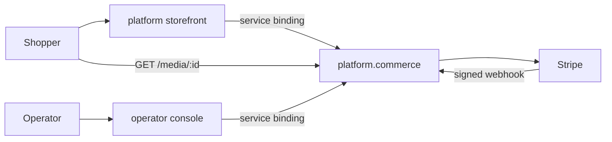
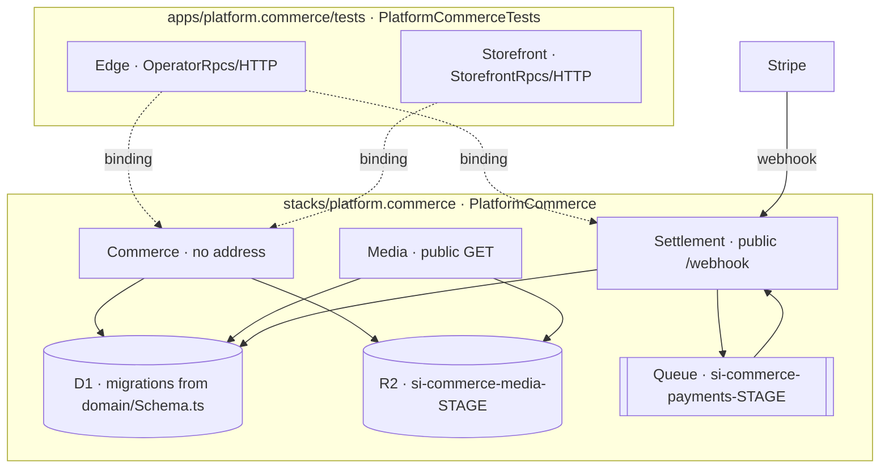
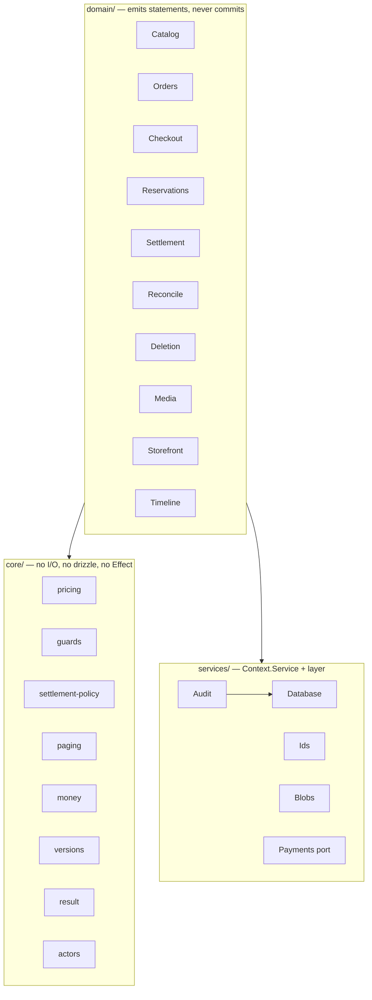

# platform.commerce

The commerce substrate: product lifecycle, checkout, settlement and fulfilment.
Ported from the `store-spike` repo.

Consumed over a **service binding**. Nothing in this package renders anything,
and the only public routes it deploys are a signature-verified webhook and a
read-only media stream.

## What it implements

| Capability        | Detail                                                                                            |
| ----------------- | ------------------------------------------------------------------------------------------------- |
| Product lifecycle | draft → release → active release. Draft is operator state; a release is immutable while retained. |
| Variants          | size and SKU per product, stock or pre-order mode, expected ship date                             |
| Pre-order runs    | per-product cap; claims guarded against oversubscription                                          |
| Media             | R2-backed, streamed through a Worker, ordered, roles `cover` / `gallery` / `evidence`             |
| Storefront reads  | list and detail, sourced only from the active release                                             |
| Checkout          | cart pricing, stock reservation, payment session creation                                         |
| Settlement        | provider webhook → queue → order state, with replay and refunds                                   |
| Reconcile         | cron sweep that heals lost webhooks and releases abandoned stock                                  |
| Order lifecycle   | `pending → paid → shipped → delivered`, `cancelled` as a terminal exit                            |
| Fulfilment        | carrier and tracking, delivery marking                                                            |
| Deletion          | two-phase plan/confirm with an impact report and drift detection                                  |
| Audit             | every mutation and its ledger row commit in one D1 batch                                          |
| Idempotency       | command ledger keyed per actor, action and command id                                             |

## What deploys

`stacks/platform.commerce/alchemy.run.ts` → `CommerceModule`.

| Worker         | Address                    | Surface                                                                                                              |
| -------------- | -------------------------- | -------------------------------------------------------------------------------------------------------------------- |
| **Commerce**   | none (`workersDev: false`) | 30 methods over service binding — the whole domain                                                                   |
| **Settlement** | public                     | `POST /webhook` (HMAC-verified); queue consumer; cron `*/15 * * * *`; `settleNow` `sweepNow` `provider` over binding |
| **Media**      | public                     | `GET /media/:id`, read-only                                                                                          |

Plus one D1, one R2 bucket, one queue, and the drizzle schema resource that
generates their migrations.

**There is no unauthenticated write path in the deployed set.** No worker here
mounts an `RpcServer` over HTTP; the only two `fetch` handlers are the
signature-verified webhook and a `GET`-only media route.

**There is no test double in it either.** `PaymentsProvider.resolve` knows one
provider; a stage that cannot configure Stripe fails the deploy at every stage,
`dev` included. The fake and the Workers that may use it are under `tests/`,
which `module.ts` cannot import — so the deployed schema is 11 domain tables and
the deployed bundles contain no fake.

The spike had both problems: the fallback to the fake was gated to `dev`, but a
gated branch still ships, so `PaymentsFake` was in every production bundle — and
its `fake_session` table was re-exported from the schema module to reach
drizzle-kit, so it was in the one linear migration set applied to every database.
Production carried an empty table belonging to a double it cannot run.

### Commerce methods

```
catalog     listProducts getProduct createProduct saveProductDraft publishProduct
            setProductStatus putVariant setPreorderCap adjustStock
            ingestProductMedia reorderProductMedia
orders      listOrders getOrder orderTimeline setOrderStatus fulfillOrder markDelivered
deletion    planProductReleaseDeletion deleteProductRelease planProductDeletion
            deleteProduct planVariantDeletion deleteVariant
            planProductMediaDeletion deleteProductMedia
storefront  placeOrder getCustomerOrder listStorefront getStorefrontProduct
config      paymentsProvider
```

## What does not deploy

`tests/` holds four Workers and a payment provider, declared by
`tests/alchemy.run.ts` and by nothing else — a different stack name, a different
state key, and no import path from `module.ts` that could pull any of them into
a real deploy.

| File                       | Why it is test-only                                                                                                                     |
| -------------------------- | --------------------------------------------------------------------------------------------------------------------------------------- |
| `workers/Edge.ts`          | `OperatorRpcs` over HTTP, minting a hardcoded operator. Deployed, that is unauthenticated write access to the catalogue and order book. |
| `workers/Storefront.ts`    | `StorefrontRpcs` over HTTP, including an anonymous `placeOrder` keyed on an unverified email.                                           |
| `workers/Commerce.ts`      | The same surface `workers/Commerce.ts` deploys, on a provider that may fall back to the fake.                                           |
| `workers/Settlement.ts`    | Ditto. Paired with the above — a session minted by one provider cannot be settled by another.                                           |
| `services/PaymentsFake.ts` | D1-backed payment double. Creates its own table where it runs; never in a migration.                                                    |

Edge and Storefront exist because a test process is not a Worker and cannot hold
a service binding. The suites are the regression surface for this business
function, so the ingress they need is kept — parked where it cannot be mistaken
for product.

The test Commerce and Settlement exist so the fake has somewhere to be injected
that a deployed worker cannot see. Both import the same `workers/*Surface.ts` the
deployed entries do, so a green suite is evidence about the code that ships; the
only difference between the pairs is which provider goes in.

The spike's operator console (a SPA plus a `/api/*` write table on the same
hardcoded actor) is not ported.

## Architecture

### C1 — Context



### C2 — Container



### C3 — Component



`core/` is fallow's `app-core` zone: `allow: []`, and `fetch`, `caches.*`,
`crypto.subtle.*` and `cloudflare:workers.*` are forbidden calls.

## Data model

`product` `product_draft` `product_release` `product_image`
`product_release_image` `product_variant` `customer_order` `order_item`
`payment_event` `command_event` `store_operator_deletion_intent`

D1 has no transactions. `batch` is the only atomicity primitive; writes use
guarded conditional UPDATEs and read `meta.changes`.

## Layout

```
module.ts                 the deployable unit
runtime.ts                schema, D1, R2, capability layers
paths.ts                  absolute anchors for the schema resource
core/                     pure decisions
domain/                   statements and typed failures
services/                 capabilities — Stripe only, no double
workers/
  Commerce.ts             entry: Stripe or nothing
  CommerceSurface.ts      the 30 methods, provider-agnostic
  Settlement.ts           entry: Stripe or nothing
  SettlementSurface.ts    webhook, queue, cron, provider-agnostic
  Media.ts                GET /media/:id
infrastructure/           Stripe dev listener (deploy host only)
tests/
  alchemy.run.ts          the test stack — the only place tests/ is declared
  workers/                Commerce, Settlement, Edge, Storefront
  services/               PaymentsFake, FakeProvider
  unit/                   157 tests, no infrastructure
  *.integ.test.ts         30 tests against a live deployment
migrations/               11 domain tables, generated from domain/Schema.ts
```

The `*Surface.ts` split is what makes the provider cordon structural rather than
remembered: a worker choosing its provider with an `if` puts the fake in its
bundle whichever branch runs. Two entrypoints importing one surface do not.

## Consume it

An app that wants Commerce is declared in
`stacks/platform.commerce/alchemy.run.ts`, alongside the module. A service
binding names a resource its stack owns and does not cross a stack boundary —
the same reason `Auth` publishes an origin rather than a binding.

```ts
// Effect worker
const commerce = yield * Cloudflare.Workers.bindWorker(CommerceWorker);
const products = yield * commerce.listStorefront();

// plain worker
import { toRpcAsync } from "alchemy/Cloudflare/Bridge";
const commerce = toRpcAsync<CommerceWorker>(env.COMMERCE);
const products = await commerce.listStorefront();
```

Declare the binding in the stack. An Effect worker registers it through
`bindWorker`; a plain worker takes `env`:

```ts
Cloudflare.Worker("Storefront", {
  main: "apps/platform.storefront/worker.ts",
  env: { COMMERCE: CommerceWorker },
});
```

Mutations take an envelope carrying the actor and an idempotency key. **Commerce
performs no authorization of its own** — it trusts `meta.actor` as already
validated by whoever bound it. Minting that actor from a real session is the
consuming app's job, and it is the whole reason Commerce has no address. See
`domain/Contracts.ts`; `customerCall` builds the guest form.

Domain calls return `DomainResult`. Success and typed refusals are both values;
refusals never throw.

## Run it

```sh
bun run commerce:plan                       # from the repo root
ALCHEMY_STAGE=dev_$USER bun run commerce:deploy
bun run commerce:dev
```

### Test

```sh
vp run platform.commerce#test               # 157 unit, ~90ms, no infrastructure
cd apps/platform.commerce
bun run test:integ                          # 30 integration; deploys and tears down
bun run test:keep                           # keeps the test stack up between runs
```

| Tier                   | Count | Needs                           |
| ---------------------- | ----- | ------------------------------- |
| Unit and contract      | 157   | nothing                         |
| Operator integration   | 13    | a deployment                    |
| Settlement integration | 9     | a deployment                    |
| Stripe end-to-end      | 8     | a deployment and `stripe login` |

Setup is `stripe login`. Without the CLI the stack runs the fake payment
provider and the Stripe suite skips.

## Configuration

| Variable                                               | Stages               | Effect                                 |
| ------------------------------------------------------ | -------------------- | -------------------------------------- |
| `STORE_STOREFRONT_URL`                                 | required outside dev | payment return URL                     |
| `STORE_SHIPPING_CENTS_CA` / `_US`                      | optional             | flat shipping rates, default $12 / $22 |
| `STRIPE_TEST_*` / `STRIPE_SANDBOX_*` / `STRIPE_LIVE_*` | per stage            | provider keys and webhook secret       |

Stage names select the environment: `prod` / `production` → live,
`preprod` / `staging` → sandbox, every other name → dev.

## Before it takes real money

- Register for GST/HST in Stripe Tax. Without a registration every Canadian
  order is taxed $0.
- Point a live webhook endpoint at the module's `webhookUrl` for the six events
  in `FORWARDED_EVENTS`, and set its signing secret.
- Set `STORE_STOREFRONT_URL`.
- Give the D1 in `runtime.ts` what `platform.auth`'s has — a pinned name, an id
  guard, and a retain policy. Today every stage gets its own stage-derived
  database, which is right until one of them holds orders.
- Deploy under a stage named `prod`.
