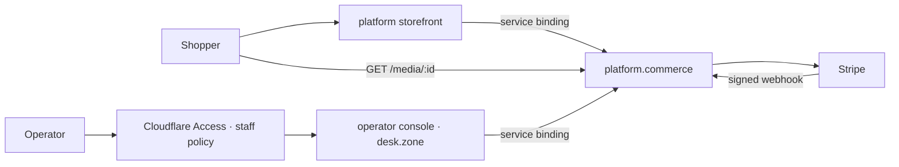
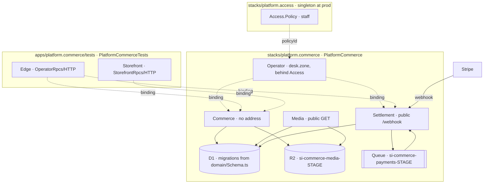
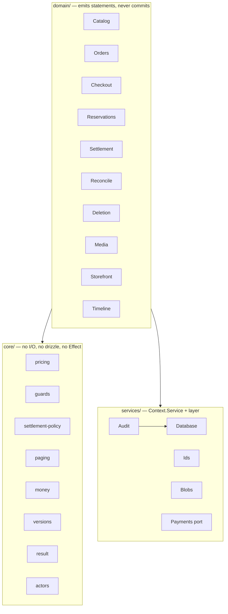

# platform.commerce

The commerce substrate — product lifecycle, checkout, settlement and fulfilment
— and the operator console that drives it.

The substrate is consumed over a **service binding** and has no address of its
own. The console is the app that holds that binding: it lives in `app/` rather
than in a package of its own precisely because a service binding names a
resource its stack owns, so giving Commerce a consumer in another package would
have meant giving Commerce a URL.

Public routes, in full: a signature-verified webhook, a read-only media stream,
and the console behind a Cloudflare Access application.

## What it implements

| Capability        | Detail                                                                                            |
| ----------------- | ------------------------------------------------------------------------------------------------- |
| Product lifecycle | draft → release → active release. Draft is operator state; a release is immutable while retained. |
| Variants          | size and SKU per product, stock or pre-order mode, expected ship date                             |
| Pre-order runs    | per-product cap; claims guarded against oversubscription                                          |
| Media             | R2-backed, streamed through a Worker, ordered, roles `cover` / `gallery` / `evidence`             |
| Storefront reads  | list and detail, sourced only from the active release                                             |
| Checkout          | cart pricing, stock reservation, payment session creation                                         |
| Settlement        | provider webhook → queue → order state, with replay and refunds                                   |
| Reconcile         | cron sweep that heals lost webhooks and releases abandoned stock                                  |
| Order lifecycle   | `pending → paid → shipped → delivered`, `cancelled` as a terminal exit                            |
| Fulfilment        | carrier and tracking, delivery marking                                                            |
| Deletion          | two-phase plan/confirm with an impact report and drift detection                                  |
| Audit             | every mutation and its ledger row commit in one D1 batch                                          |
| Idempotency       | command ledger keyed per actor, action and command id                                             |

## What deploys

`stacks/platform.commerce/alchemy.run.ts` → `CommerceModule`.

| Worker         | Address                      | Surface                                                                                                              |
| -------------- | ---------------------------- | -------------------------------------------------------------------------------------------------------------------- |
| **Commerce**   | none (`workersDev: false`)   | 32 methods over service binding — the whole domain                                                                   |
| **Settlement** | public                       | `POST /webhook` (HMAC-verified); queue consumer; cron `*/15 * * * *`; `settleNow` `sweepNow` `provider` over binding |
| **Media**      | public                       | `GET /media/:id`, read-only                                                                                          |
| **Operator**   | `desk.<zone>`, behind Access | The console. TanStack Start. Binds Commerce and Settlement; holds no data binding of its own                         |

Plus one D1, one R2 bucket, one queue, one Access application, and the drizzle
schema resource that generates the migrations.

**There is no unauthenticated write path in the deployed set.** No worker here
mounts an `RpcServer` over HTTP; the only public `fetch` handlers are the
signature-verified webhook, a `GET`-only media route, and the console — which
sits behind a Cloudflare Access application and re-verifies the assertion itself
before any route or server function runs.

**There is no test double in it either.** `PaymentsProvider.resolve` knows one
provider; a stage that cannot configure Stripe fails the deploy at every stage,
`dev` included. The fake and the Workers that may use it are under `tests/`,
which `module.ts` cannot import — so the deployed schema is 11 domain tables and
the deployed bundles contain no fake.

The spike had both problems: the fallback to the fake was gated to `dev`, but a
gated branch still ships, so `PaymentsFake` was in every production bundle — and
its `fake_session` table was re-exported from the schema module to reach
drizzle-kit, so it was in the one linear migration set applied to every database.
Production carried an empty table belonging to a double it cannot run.

### Commerce methods

```
catalog     listProducts getProduct createProduct saveProductDraft publishProduct
            setProductStatus putVariant setPreorderCap adjustStock
            ingestProductMedia reorderProductMedia
            streamOperatorMedia operatorMediaContentType
orders      listOrders getOrder orderTimeline setOrderStatus fulfillOrder markDelivered
deletion    planProductReleaseDeletion deleteProductRelease planProductDeletion
            deleteProduct planVariantDeletion deleteVariant
            planProductMediaDeletion deleteProductMedia
storefront  placeOrder getCustomerOrder listStorefront getStorefrontProduct
config      paymentsProvider
```

### Availability

A sale passes **two** guards: the per-variant decrement, and — for a pre-order
line only — the run claim, which additionally requires `preorder_cap` to exist.
`core/availability.ts` is that rule as one pure function, and it is what both
`Storefront.getActiveProductBySlug` and `Catalog.getProduct` report `available`
from. Before it, each answered `stock > 0` independently and neither consulted
the run, so a fully-subscribed run advertised every size as buyable and refused
at Buy.

`preorder_cap_missing` is the other half. A pre-order variant under a product
with no cap makes the run guard match zero rows on every claim, so the product
goes live looking normal and refuses every buyer forever. Both doors to `active`
— `publishProduct`, which sets the status itself, and `setProductStatus` — now
refuse that shape, and `setPreorderCap` refuses to clear the cap out from under
a live one. **Set the cap before you publish.**

`streamOperatorMedia` / `operatorMediaContentType` are the console's image path,
and the only pair here with no status gate. They exist because `publishProduct`
refuses with `missing_media` until a product has a cover, while the public
`GET /media/:id` joins through `product.status = 'active'` — so the entire
pre-publish window is exactly when the public route is guaranteed to 404, and an
operator would be uploading blind. Both are binding-only, the public route is
unchanged, and withdrawing a product still kills every image link anyone already
had. The stream is handed from R2 through to the response; nothing is buffered.

## The console

`app/` is a TanStack Start application, deployed as the **Operator** worker
above. It lives in this package rather than beside it for one reason: a service
binding names a resource its own stack owns, and Commerce has no address at all.
An `apps/platform.commerce.operator` would have had to reach Commerce over a URL
— which means giving Commerce a URL, and the whole design rests on it not having
one. `platform.auth` splits the same way: `api/` is the worker, `app/` is the
surface in front of it.

| Route                  | What it is                                                                               |
| ---------------------- | ---------------------------------------------------------------------------------------- |
| `/`                    | Work queue: ready to ship, awaiting payment, drafts. Warns if the two providers disagree |
| `/products`            | The catalogue, filtered by status. Creating lands a draft                                |
| `/products/$productId` | Draft, lifecycle, variants and stock, pre-order cap, media, and four deletion flows      |
| `/orders`              | The order book, filtered by status                                                       |
| `/orders/$orderNumber` | Receipt, address, line items, fulfilment, and the merged audit timeline                  |
| `/storefront`          | What is actually on sale — read from the active release, not from the draft              |
| `/storefront/$slug`    | One product as a shopper gets it                                                         |
| `/settings`            | Which provider mints, which settles, whether it is live money, and the reconcile sweep   |

**The boundary.** `app/worker.ts` resolves a verified `OperatorActor` before any
route, loader or server function runs, and fails closed — a misconfiguration is
a 500, anything else is a 403. Server functions read that actor back through
`requireOperator` rather than re-verifying the assertion, so "did we check" has
one answer. The gate is deliberately checked twice: Cloudflare Access refuses
non-staff at the edge, and this worker verifies the JWT signature, issuer,
audience and expiry itself, because a Worker is reachable by script name from
inside the account and a missing Access application is invisible from outside.
`POLICY_AUD` is the application's own `aud` output rather than a copied literal,
so the value Access mints and the value the worker checks cannot drift.
`tests/unit/operator-access.test.ts` covers the refusals.

**What it holds.** Two service bindings and three vars. No D1, no R2, no queue,
no Stripe key. Everything the console can do it does by asking Commerce or
Settlement, which is what keeps the domain's guards — revision conflicts,
publish gates, stock arithmetic — on the far side of a boundary the UI cannot
route around. The browser supplies exactly one field toward a mutation envelope:
an opaque `commandId`. `actor`, `requestId` and `idempotencyKey` are all minted
server-side, so a client cannot assert an identity by choosing a key.

**Refusals are rendered, not swallowed.** `missing_variant`, `missing_media`,
`no_release`, `revision_conflict`, `cap_below_claimed`, `payment_incomplete` —
the console shows the domain's own code alongside a sentence explaining it. No
button is disabled to imitate a domain rule; the call goes and the answer is
displayed, because a disabled button is a second copy of a rule that drifts.

## What does not deploy

`tests/` holds four Workers and a payment provider, declared by
`tests/alchemy.run.ts` and by nothing else — a different stack name, a different
state key, and no import path from `module.ts` that could pull any of them into
a real deploy.

| File                       | Why it is test-only                                                                                                                     |
| -------------------------- | --------------------------------------------------------------------------------------------------------------------------------------- |
| `workers/Edge.ts`          | `OperatorRpcs` over HTTP, minting a hardcoded operator. Deployed, that is unauthenticated write access to the catalogue and order book. |
| `workers/Storefront.ts`    | `StorefrontRpcs` over HTTP, including an anonymous `placeOrder` keyed on an unverified email.                                           |
| `workers/Commerce.ts`      | The same surface `workers/Commerce.ts` deploys, on a provider that may fall back to the fake.                                           |
| `workers/Settlement.ts`    | Ditto. Paired with the above — a session minted by one provider cannot be settled by another.                                           |
| `services/PaymentsFake.ts` | D1-backed payment double. Creates its own table where it runs; never in a migration.                                                    |

Edge and Storefront exist because a test process is not a Worker and cannot hold
a service binding. The suites are the regression surface for this business
function, so the ingress they need is kept — parked where it cannot be mistaken
for product.

The test Commerce and Settlement exist so the fake has somewhere to be injected
that a deployed worker cannot see. Both import the same `workers/*Surface.ts` the
deployed entries do, so a green suite is evidence about the code that ships; the
only difference between the pairs is which provider goes in.

The spike's operator console is not ported EITHER, and the distinction matters:
what it did is now in `app/`, but nothing about how it did it survived. The
spike was a SPA plus a `/api/*` write table minting one hardcoded actor —
`operator:console`, a stand-in for an identity check that did not exist. The
console here has no `/api/*` table at all (server functions, one per operation,
each extracted into its own module by the Start compiler) and mints its actor
from a verified Cloudflare Access assertion. The pages it grew beyond the
spike's are deletion, media reordering and the storefront preview.

## Architecture

### C1 — Context



### C2 — Container



The console holds NO edge to D1, R2 or the queue, and that absence is the
design: everything it can do it does through the two dotted lines.

### C3 — Component



`core/` is fallow's `app-core` zone: `allow: []`, and `fetch`, `caches.*`,
`crypto.subtle.*` and `cloudflare:workers.*` are forbidden calls.

## Data model

`product` `product_draft` `product_release` `product_image`
`product_release_image` `product_variant` `customer_order` `order_item`
`payment_event` `command_event` `store_operator_deletion_intent`

D1 has no transactions. `batch` is the only atomicity primitive; writes use
guarded conditional UPDATEs and read `meta.changes`.

## Layout

```
module.ts                 the deployable unit — workers, Access application, console
runtime.ts                schema, D1, R2, capability layers
paths.ts                  absolute anchors for the schema resource and Vite's root
vite.config.ts            the console's build; the Workers never pass through Vite
core/                     pure decisions — pricing, guards, availability
domain/                   statements and typed failures
services/                 capabilities — Stripe only, no double
workers/
  Commerce.ts             entry: Stripe or nothing
  CommerceSurface.ts      the 32 methods, provider-agnostic
  Settlement.ts           entry: Stripe or nothing
  SettlementSurface.ts    webhook, queue, cron, provider-agnostic
  Media.ts                GET /media/:id
app/                      the operator console — TanStack Start
  tsconfig.json           its OWN project: this tree needs DOM, the substrate must not have it
  worker.ts               the Access gate, and the console's own /media/:id
  routes/                 eight routes; see "The console" above
  components/             page furniture, badges, tables, the deletion dialog
  lib/*.functions.ts      server functions — one file per domain area
  lib/*.server.ts         the bindings and the gate; never reachable from a client bundle
infrastructure/           Stripe dev listener (deploy host only)
tests/
  alchemy.run.ts          the test stack — the only place tests/ is declared
  workers/                Commerce, Settlement, Edge, Storefront
  services/               PaymentsFake, FakeProvider
  unit/                   179 tests, no infrastructure
  *.integ.test.ts         30 tests against a live deployment
migrations/               11 domain tables, generated from domain/Schema.ts
```

**Two TypeScript projects, deliberately.** `tsconfig.json` omits `DOM` because
`@cloudflare/workers-types` supplies `Request`, `Response` and `ReadableStream`
for the Workers and the domain, and browser variants shadowing them disagree
about `Request.cf` and R2 bodies. `app/` renders and needs `DOM` anyway, so it
carries its own config — at `app/`, not beside it, because a file resolves
against its NEAREST ancestor config and two configs in one directory would not
split.

The `*Surface.ts` split is what makes the provider cordon structural rather than
remembered: a worker choosing its provider with an `if` puts the fake in its
bundle whichever branch runs. Two entrypoints importing one surface do not.

## Consume it

An app that wants Commerce is declared in this package or in
`stacks/platform.commerce/alchemy.run.ts`, alongside the module. A service
binding names a resource its stack owns and does not cross a stack boundary —
the same reason `Auth` publishes an origin rather than a binding, and the reason
the console lives in `app/` here rather than in an `apps/` package of its own.
`app/lib/commerce.server.ts` is the worked example.

```ts
// Effect worker
const commerce = yield * Cloudflare.Workers.bindWorker(CommerceWorker);
const products = yield * commerce.listStorefront();

// plain worker — `typeof`, not the instance type: `Rpc.Shape` unwraps the
// CLASS VALUE's type, and the instance type recovers nothing.
import { toRpcAsync } from "alchemy/Cloudflare/Bridge";
const commerce = toRpcAsync<typeof CommerceWorker>(env.COMMERCE);
const products = await commerce.listStorefront();
```

Declare the binding in the stack. An Effect worker registers it through
`bindWorker`; a plain worker takes `env`:

```ts
Cloudflare.Worker("Storefront", {
  main: "apps/platform.storefront/worker.ts",
  env: { COMMERCE: CommerceWorker },
});
```

Mutations take an envelope carrying the actor and an idempotency key. **Commerce
performs no authorization of its own** — it trusts `meta.actor` as already
validated by whoever bound it. Minting that actor from a real session is the
consuming app's job, and it is the whole reason Commerce has no address. See
`domain/Contracts.ts`; `customerCall` builds the guest form.

Domain calls return `DomainResult`. Success and typed refusals are both values;
refusals never throw.

## Run it

```sh
bun run commerce:plan                       # from the repo root
ALCHEMY_STAGE=dev_$USER bun run commerce:deploy
bun run commerce:dev
```

**`stacks/platform.access` must be deployed first**, at `prod`, once for the
account:

```sh
ALCHEMY_STAGE=prod bun run access:deploy
```

It owns the staff policy the console's Access application gates on, and it is a
SINGLETON — one policy per account, not one per stage, because "who counts as
staff" is not a per-stage question. Every stage of this app pins to that one
deployment. Until it is applied, `commerce:plan` fails with
`InvalidReferenceError`, which reads like a bug in this stack rather than an
unapplied dependency.

Under `alchemy dev` the console answers on a local port with
`OPERATOR_AUTH=none` and runs as a fixed `operator:dev` actor — the gate is
absent from the request path rather than present and declining to act. That
value is set by the deploy, never inferred, and a real deploy always sets
`access`. Every deployed stage claims a hostname (`desk.<zone>` at prod,
`desk-<stage>.<zone>` elsewhere) with its own Access application, and
`workersDev` is off unconditionally: a workers.dev URL is on Cloudflare's zone
rather than this account's, so no Access application can ever sit in front of
one, and an ungated console is unauthenticated write access to the catalogue and
the order book.

### Test

```sh
vp run platform.commerce#test               # 179 unit, ~280ms, no infrastructure
cd apps/platform.commerce
bun run test:integ                          # 30 integration; deploys and tears down
bun run test:keep                           # keeps the test stack up between runs
```

| Tier                   | Count | Needs                           |
| ---------------------- | ----- | ------------------------------- |
| Unit and contract      | 179   | nothing                         |
| Operator integration   | 13    | a deployment                    |
| Settlement integration | 9     | a deployment                    |
| Stripe end-to-end      | 8     | a deployment and `stripe login` |

The unit tier includes `operator-access.test.ts`, which is the console's gate
under test: a token minted for a DIFFERENT Access application on the same team,
a token signed by the wrong key, an expired one, and a service token with no
`email` all have to be refused — and every one of them verifies fine against a
check that forgot a clause. It injects a local JWKS, so it never touches the
network.

Setup is `stripe login`. Without the CLI the stack runs the fake payment
provider and the Stripe suite skips.

## Configuration

| Variable                                               | Stages               | Effect                                 |
| ------------------------------------------------------ | -------------------- | -------------------------------------- |
| `STORE_STOREFRONT_URL`                                 | required outside dev | payment return URL                     |
| `STORE_SHIPPING_CENTS_CA` / `_US`                      | optional             | flat shipping rates, default $12 / $22 |
| `STRIPE_TEST_*` / `STRIPE_SANDBOX_*` / `STRIPE_LIVE_*` | per stage            | provider keys and webhook secret       |

Stage names select the environment: `prod` / `production` → live,
`preprod` / `staging` → sandbox, every other name → dev.

## Before it takes real money

- Register for GST/HST in Stripe Tax. Without a registration every Canadian
  order is taxed $0.
- Point a live webhook endpoint at the module's `webhookUrl` for the six events
  in `FORWARDED_EVENTS`, and set its signing secret.
- Set `STORE_STOREFRONT_URL`.
- Give the D1 in `runtime.ts` what `platform.auth`'s has — a pinned name, an id
  guard, and a retain policy. Today every stage gets its own stage-derived
  database, which is right until one of them holds orders.
- Deploy `stacks/platform.access` at `prod`, once, before anything else here.
- Deploy under a stage named `prod`.
- Open `/settings` on the console and check that **checkout mints with** and
  **settlement settles with** name the same provider. They come from two Workers
  that resolve their provider independently, and a deployment where they
  disagree takes a payment successfully and never marks the order paid. The
  overview page warns about this too, in red.
- Confirm there is exactly ONE Access application on `desk.<zone>`. The
  provider observes only by a persisted `applicationId`, so declaring one
  against a hostname that already has a hand-made application creates a SECOND
  with a fresh `aud` — the gate still stands, but every request then fails
  verification with `Invalid or expired Access token`.
